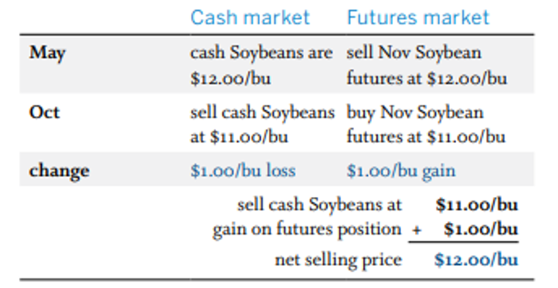
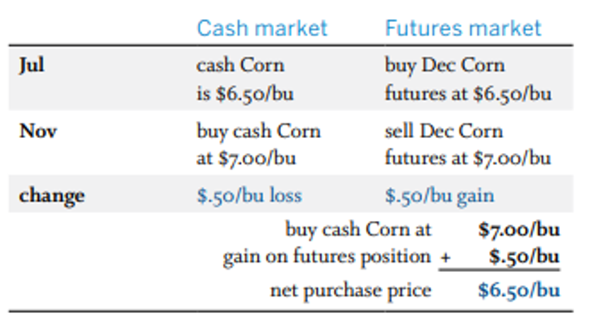
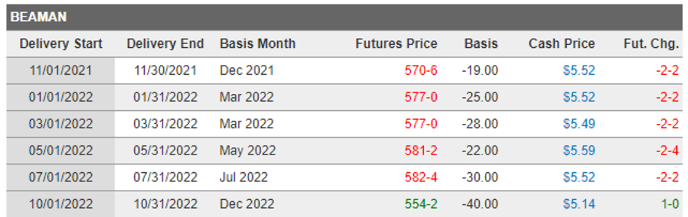
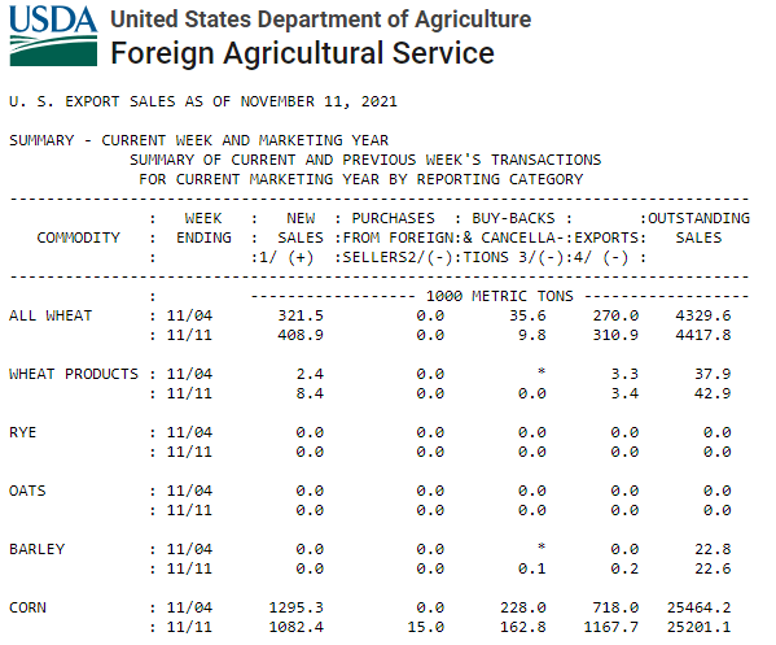
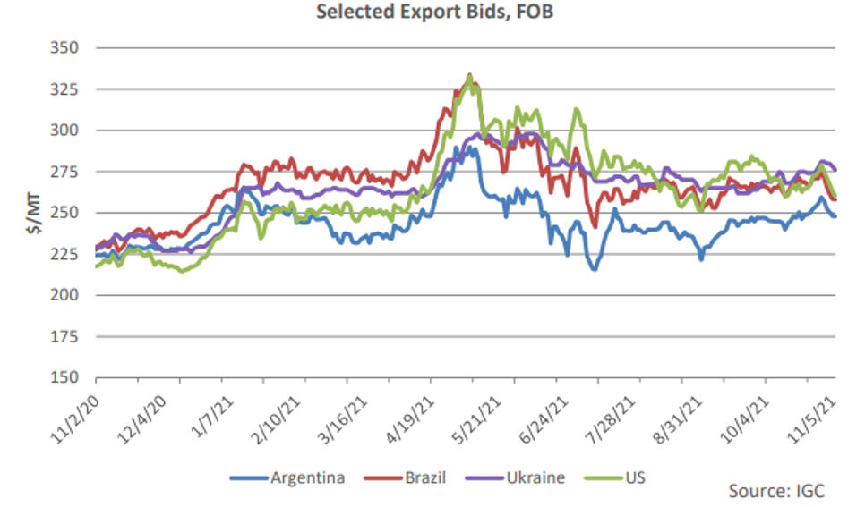
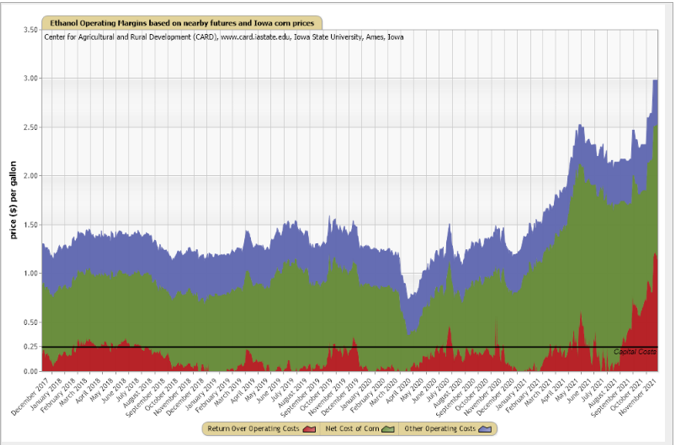
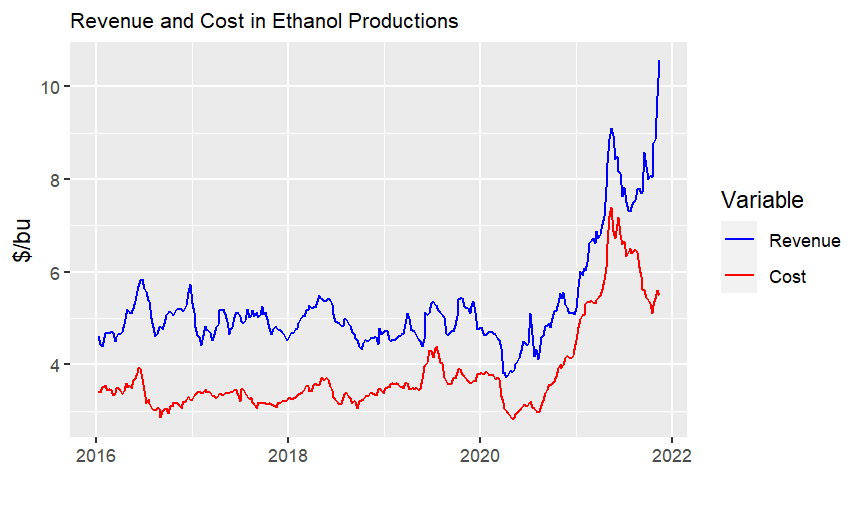
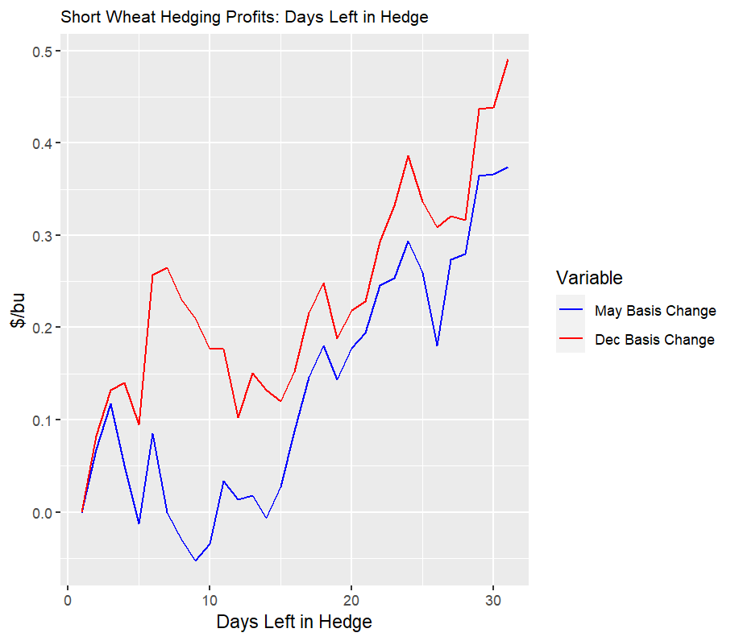

```{r setup, include=FALSE}
knitr::opts_chunk$set(echo = TRUE)
pacman::p_load(here, dplyr, ggplot2, lubridate, kableExtra)
```

## Learning Outcomes

By working on this module you should be able to 

- Differentiate long and short positions in the spot market and the corresponding price risk
- Explain the mechanics of a short hedge, a long hedge and hedging the crush margin
- Describe the histogram procedure for measuring the effectiveness of hedging in the Iowa corn market
- Use theory to connect hedging profits to the change in the net basis over time
- Use theory to connect hedging profits to information shocks which affect the slope of the forward curve over time.
- Describe how hedging profits were impacted by the sharp increase in demand for wheat in the early days of the COVID-19 pandemic

## Overview of this Module

Recall from Module 2A that the two main functions of a commodity futures market are price discovery and price risk transfer through hedging. The purpose of this module is to use empirical and theoretical analysis to demonstrate how hedging works to reduce price risk. It is commonly said that hedging replaces price risk with basis risk. This statement implies that it is necessary to understand the risk properties of the basis in order to assess expected profits and the risk-reducing benefits of hedging. 

The first half of this module is largely devoted to empirical analysis and the second half is devoted to theoretical analysis. For the empirical analysis three case studies are constructed. The first case study is an agricultural cooperative which becomes long in the spot market by signing a deferred delivery agreement with a local corn farmer. The second case study is a multinational corn exporter who becomes short in the corn spot market by signing a forward sales agreement with an overseas importer. The third case study is an ethanol processor who forward sells distillers dried grains (DDG), which is an ethanol by product, and in doing so becomes short in the ethanol spot market and long in the corn spot market. The cooperative uses a short corn hedge to offset price risk from its long position in the spot market, and the exporter uses a long corn hedge to offset price risk from its short position in the spot market. The processor uses a short ethanol hedge and a long corn hedge to offset its joint price risk.

The second half of this module focuses on the theory of hedging. It begins by showing why the profits of the short hedger can be measured by the net change in the basis over time, and the profits of the long hedger are the same as the profits of the short hedger but with the opposite sign. This means that uncertainty in the basis is equivalent to uncertainty in hedging profits, and as such we can say that hedging replaces price risk with basis risk. A crush margin for the ethanol plant is the difference between the combined sales value of ethanol and distillers dried grains (DDG) minus the cost of the corn, all expressed on a per bushel basis. It is shown that profits earned on the ethanol crush with the DDG pre-sold is equal to the net change in the basis of the ethanol minus the net change in the basis of the corn over the hedging period.

Changes in the basis over time consist of a predictable component and a non-predictable component. The net change in the basis and thus the profits of the short hedger is the change in the non-predictable component of the basis. The predictable component of the basis is fully summarized by the base case saw-toothed pricing pattern of the forward curve. The non-predictable component of the basis can be at the level of the individual grain merchant or the level of the region as a whole. The first half of the theoretical analysis focuses on the non-predictable component of the basis at the firm level and the second half focuses on the non-predictable component at the regional level.

To conclude this overview section it is useful to review the standard textbook description of hedging. Figures \@ref(fig:text-shorthedge) and \@ref(fig:text-longhedge) are typical [textbook](http://simpson.ca.uky.edu/files/cme-self_study_guide_to_futures_and_options.pdf) examples. Figure \@ref(fig:text-longhedge) assumes that in May a merchant purchased soybeans from a farmer at price \$12/bu. To offset the risk of a falling price the merchant takes a short position with a November soybean futures market at price \$12/bu. This example is kept very simple by assuming the basis is equal to zero. In October the soybeans are sold in the spot market at price \$11/bu. The price of the November futures contract has also dropped to \$11/bu. The short futures position generates a profit of \$1/bu, and when this profit is added to the \$11/bu selling price of soybeans in the spot market, the net price received for the soybeans is \$12/bu, which is the price paid to the farmer. In this simple example the basis remains equal to zero and so hedging profits must necessarily be equal to zero (i.e., the merchant expects to break even).      

:::: {.columns}
::: {.column width="50%"}
```{r text-shorthedge, echo=FALSE, fig.cap = "Short Hedge", fig.align='center', out.width = "80%"}

```
:::

::: {.column width="50%"}
```{r text-longhedge, echo=FALSE, fig.cap = "Long Hedge", fig.align='center', out.width = "80%"}

```
:::

::::

Figure \@ref(fig:text-longhedge) features the long hedge. The corn exporter is assumed to have forward sold the corn in July at price
 \$6.50/bu. To corn will be purchased in the spot market in November and delivered to the buyer. To protect against a price rise in the interim period, the merchant takes a long position in the corn market, which are also trading at \$6.50/bu. By November the spot price and the futures price have both risen to \$7.00/bu. The \$0.50/bu gain in the long futures contract implies that the net purchase price of the corn in the spot market is \$6.50/bu. Similar to the short hedge example, the basis is zero throughout the hedging period, which means that long hedging profits are equal zero (i.e., the net buy price of the corn is equal to the initial sell price).
 
## Part A: Case Study: Corn and Ethanol in Iowa

In this section we will conduct a detailed empirical analysis of three hedging scenarios involving corn in the U.S. state of Iowa. The three hedging scenarios are as follows:

- The Mid Iowa grain cooperative has purchased corn from a farmer and it wishes to hedge against a price drop until the corn is resold.
- A large multinational grain company (e.g., ADM) has forward sold corn to a Japanese importer and it wishes to hedge against a price increase until the point in time when the corn is purchased and delivered to the importer.
- An ethanol plan has forward sold DDG and is now committed to purchase corn and process it into ethanol in order to create the DDG which have been forward sold. The plant manager wishes to simultaneously hedge against a price decrease in the ethanol market and a price increase in the corn market.

The textbook examples of hedging considered above make it appear that hedging is a highly effective tool for transferring price risk. The reality is quite different. First, futures contracts for the major commodities such as corn, soybeans and wheat trade in 5000 bushel units. This makes it difficult to match the volume of commodity to be hedged in the spot market with a futures market transaction. Second, if the commodity price surges upward then the short hedger will eventually have a higher spot price but in the interim must be able to cover margin calls. If an agricultural cooperative short hedges 500,000 bushels of corn, which is the equivalent of 100 contracts, a $0.50/bu surge in the price of corn would result in a \$250,000 margin call for the cooperative. 

The purpose of the three case studies is to examine the most important reason why hedging in real-world markets is usually much less attractive that what is portrayed in the textbook examples. Specifically, the goal is to do a visual comparison of price risk in the corn market with and without a hedge for the three scenarios described above. In all three cases it will be shown that hedging is only moderately effective at reducing price risk. Nevertheless, compared to purchasing insurance which is designed to fully eliminate risk for the insured hazards, hedging is relatively inexpensive. Thus, hedging is widely used despite the fact that it is only moderately effective at reducing price risk.

The data for these case studies come from a Iowa State University website, which can be accessed [here](https://www.extension.iastate.edu/agdm/energy/xls/agmrcethanolplantprices.xlsx). The researchers derived the spot price for corn by adding Iowa's corn basis, as reported by the USDA, to the price of the closest CME corn contract. This means that the results of this current analysis is applicable to a "typical" region in Iowa rather than being specific to Mid Iowa Cooperative. Nevertheless, the results will be discussed as if they were specific to Mid Iowa Cooperative to ensure the discussion reads more like a case study and less like an academic research paper.

The spot price of ethanol was derived by adding the Iowa's ethanol basis as reported by the USDA, to the price of the closest CME ethanol contract. The price of distillers dried grains (DDG) are based on feedlot payments. Of particular interest is the strength of the correlation between raw corn and DDG because both are highly substitutable as a livestock feed. The correlation between corn and DDG is approximately 0.75, which is relatively strong but still far from reflecting perfect substitutability. 

### Long and Short Positions in the Spot Market

A farmer who has corn in her bin which is not committed to a deferred delivery contract is said to be long in the spot market for corn. A signed deferred delivery contract means that when the corn is eventually delivered by the farmer, the Mid Iowa Cooperative is committed to pay the cash bid price which prevailed when the contract was signed. This means that when the deferred delivery contract is signed, the farmer no longer faces price risk in the spot market and Mid Iowa Cooperative is now long in the spot market.

The two scenarios in the previous paragraph implies that a long position in the spot market is equivalent to either owning the commodity with the current market price serving as the implicit purchase price or being committed to owning the commodity in the future and paying a predetermined price when accepting delivery. This second definition of long applies to a trader who holds a long futures position because if the contract is not offset then the trader is committed to accept delivery and pay the predetermined contract price at the time of delivery. Regardless of the situation which makes a merchant long in the spot market, the one common element is that the profits will decrease if the commodity's price decreases and vice versa.

A merchant is short in the spot market if the commodity has been forward sold and so it must be purchased in the spot market at a later date to honor the terms of the forward sale. This type of transaction is equivalent to borrowing the commodity, selling it at the forward contract price and then later purchasing the commodity on the spot market to repay the loan. Feedlots, oil seed crushers and flour mills are often short in the spot market because their output has been forward sold and their raw material for creating the output will be purchased in the spot market at a later date. Holding a short futures position effectively means the commodity is forward sold at the initial futures price and later the commodity is purchased in the spot market so that it can be delivered to honour the terms of the short contract. The common theme for all traders who are short in a commodity market is that profits will decrease if the commodity's price increases, and vice versa.

The ethanol processor who forward sells distillers dried grains (DDG) is short in the DDG market. There is no futures contract for DDG and so it cannot be hedged directly. One option is to cross hedge by taking a long position in the corn futures market. If the price of corn and the price of DDG are strongly positively correlated then the price risk facing the processor in the DDG spot market will typically be offset by gains in corn futures market. 

An equally common scenario is that the processor intends on purchasing the corn at a later date and then using the corn to produce ethanol and the DDG, which it is committed to deliver. The processor would like to create a hedge against a decrease in the spread between the price of ethanol and the price of corn. The processor will not care if the two prices move or up or move down since it is only the spread between the two prices which is what matters for locking in the crush margin. Taking a long position in the corn futures market and a short position in the ethanol futures market means that the crush margin is locked in because the trader can accept delivery of the corn to comply with the terms of the corn contract, use that corn to produce the ethanol and then deliver the ethanol to comply with the conditions of the ethanol contract. These positions imply that in the absence of a hedging when the DDG are forward sold the ethanol processor is short in the corn market and long in the ethanol market. 

### Background Information
 
:::::::::::::: {.columns}
::: {.column width="50%"}
Grain buyers such as The [Mid Iowa Cooperative](https://www.midiowacoop.com/grains/cash-bids/) generally provide farmers with a menu of deferred delivery contract options. The option chosen by the farmer determines how the buyer will hedge the long spot position after the contract is signed. Figure \@ref(fig:beaman) on the right shows the prices the grain merchant in Beaman is committed to pay when the corn is delivered. The cash prices are for contracts signed on November 20, 2021 and they vary by delivery month. If the farmer wishes to deliver the corn in January of 2022 then the cooperative will use the March 2022 contract to calculate the basis. The second row shows that with a January 2022 delivery the -$0.25/bu basis is added to the Nov 20^th^ \$5.77/bu March futures price to get the \$5.52/bu price paid to farmer when the delivery is made in January. It is important to note that the March 2022 futures contract is being used in two distinct ways. First, the price of the March 2022 contract is used together with the current basis to create the cash bid. Second, an actual position in the March 2022 contract is used by the cooperative to construct the short hedge if the farmer chooses the January 2022 delivery slot. 

:::

::: {.column width="5%"} 
<!-- This is just an empty column -->
:::

::: {.column width="40%"} 
```{r beaman, echo=FALSE, fig.cap = "Corn Cash Bid, Beaman", fig.align='center'}

```
:::
::::

<!-- Option 1 for side by side. Different figure number but I can't figure out how to put Figure 3 in the middle of the box.  -->

<!-- Figure \@ref(fig:usda) shows the aggregate export sales of US. corn as of November 11, 2021. Much of the "new sales" for the week of November 11, 2021 are forward sales by firms locking in a sales price; in the coming weeks, these firms will purchase the corn and initiate the delivery process. -->

<!-- Figure \@ref(fig:exportbids) shows a graph of U.S. corn export bids relative to those of other countries. Data sourced [here](https://apps.fas.usda.gov/psdonline/circulars/grain.pdf). Exporters of U.S. corn must aggressively use forward sales to be competitive. These forward sales put exporters in a short position in the spot market. -->

<!-- :::: {.columns} -->

<!-- ::: {.column width="50%"} -->
<!-- ```{r usda, echo=FALSE, out.width="90%", fig.cap = "U.S. Export Sales as of November 11, 2021", fig.align='center'} -->
<!--  -->
<!-- ``` -->
<!-- ::: -->

<!-- ::: {.column width="50%"} -->

<!-- ```{r exportbids, echo=FALSE, out.width="80%", fig.cap = "Selected Export Bids, FOB", fig.align='center'} -->
<!--  -->
<!-- ``` -->

<!-- ::: -->

<!-- :::: -->

Next consider the large corn exporter which is short in the corn spot market after the forward sale with the Japanese importer is signed. The left panel of Figure \@ref(fig:figures-side2) shows the aggregate export sales of US. corn as of November 11, 2021. Much of the "new sales" for the week of November 11, 2021 are forward sales by firms locking in a sales price; in the coming weeks, these firms will purchase the corn and initiate the delivery process. The right panel of Figure \@ref(fig:figures-side2) shows a graph of U.S. corn export bids relative to those of other countries. Data sourced [here](https://apps.fas.usda.gov/psdonline/circulars/grain.pdf). Exporters of U.S. corn must aggressively use forward sales to be competitive. These forward sales put exporters in a short position in the spot market.

<!-- Option 2 (for side by side) but only 1 caption -->

```{r, figures-side2, fig.show="hold", out.width="50%", echo = F, fig.cap = "Forward Export Sales"}

par(mar = c(4, 4, .1, .1))
knitr::include_graphics(c("Images/usda.png", "Images/exportbids.png"))
```

To conclude this section, it is useful to describe the recipe for making ethanol. A good overview of the ethanol crush margin in the production of ethanol is contained in a [CME report](https://www.cmegroup.com/trading/agricultural/files/AC-406_DDG_CornCrush_042010.pdf). The CME notes that 1 bushel of corn produces approximately 2.8 gallons of ethanol and 17 pounds of distillers dried grains (DDGs). If we multiply ethanol’s price of x dollars/gallon by 2.8 gallons/bushel we get ethanol’s cost expressed on a per bushel basis.
If we multiply DDG price of z dollars/ton by (1/2000) tons per pound we get DDG’s price per pound. Multiply this value by 17 to get DDG’s price per bushel of corn. Altogether, multiply the price of DDG by 17/2000 = 0.0085 to convert the price to \$ per bushel.

Figure \@ref(fig:crushIowa) shows the historical ethanol crush margin in Iowa (see [here](https://www.card.iastate.edu/research/biorenewables/tools/hist_eth_gm.aspx 
)). The top of the blue shaded area is the price of ethanol. This price is broken down into: (i) the cost of buying corn net of the resale value of the DDG (green shaded area); (ii) other variable and fixed operating costs such as enzymes, natural gas and labour (blue shaded area); and (iii) and a residual, which can interpreted as a return to capital (red shaded area). The horizontal line shows that break-even return to capital. It is clear from this diagram that producing ethanol is a relatively high-risk, low-return enterprise.

```{r crushIowa, echo=FALSE, out.width="70%", fig.cap = "Historical Ethanol Crush in Iowa", fig.align='center'}

```

### Monte Carlo Simulation Procedure

The goal of the empirical analysis of the three case studies is to compare price risk with and without hedging. An effective way to do this comparison is to randomly simulate profit outcomes and then build histograms from the simulated data. The left tail of the distribution of profits shows the financial risk. Consequently, a good measure of hedging effectiveness is the extent that the hedge pulls the left tail toward the center of the histogram. 

The process of using the available data to randomly simulating profit outcomes is a form of Monte Carlo analysis. For the short and long hedging scenarios, two dates are required: date 1, which is when the deferred delivery or forward sale agreement is signed and the hedge created, and date 2, which is when the farmer delivers the corn or the exporter purchases the corn, and the hedge is lifted. The Monte Carlo procedure involves randomly selecting two dates within a specified window of time and then chronologically ordering the pair of dates to create "date 1" and "date 2". The spot and futures prices associated with these two dates are the prices which are used to calculate profits.

The Monte Carlo procedure works best with daily data but it will still work with the weekly prices which are contained in the Iowa data set. Ideally the window of time from which the two random dates are selected should be about six months to ensure that the histogram of simulated profits includes both relatively long and relatively short hedging periods. The data set only includes the futures price for the next-to-expire contract and so the maximum length of the hedging period is three months (e.g., September through November, if the December contract is being used to calculate the basis).

We first divide the weekly data into five groups:

  - December, January, and February -> March Contract group
  - March, April -> May Contract group
  - May, June -> July Contract group
  - July, August -> September Contract group
  - September, October, November -> December contract group

```{r, echo = F}
data <- read.csv(here("Data", "corn_ethanol_data.csv"), header=TRUE, sep=",", stringsAsFactors = FALSE) 
data$Date1 <- as.Date(data$Week, format = c("%m/%d/%Y")) 

profits <- readRDS(file = here("Data", "compare.rds"))

# profits_data <- left_join(profits, data, by = c("Date1"))

profits <- profits %>%
  mutate(date_diff = as.numeric(profits$Date2 - profits$Date1),
         month = month(Date1),
         group = ifelse(month == 12 | month == 1 | month == 2, 1, 
                        ifelse(month == 3 | month == 4, 2, 
                               ifelse(month == 5 | month == 6, 3,
                                      ifelse(month == 7 | month == 8, 4, 5)))))
# average by contract group
avg_period <- profits %>%
  group_by(group) %>%
  summarise(avg_period = mean(date_diff/7, na.rm = T))
```

Within each of the five contract groups in each of the six years, we ask R to randomly pick date 1 and date 2. For the 30 pairs of dates we can define the length of the hedging period as the number of weeks between dates 1 and date 2. To ensure the law of large numbers is in place we repeat the above process 300 times. Across the 9000 simulated hedging time frames the average length is `r round(mean(profits$date_diff/7), 2)` weeks. This rather short average hedging period should be kept in mind when interpreting the hedging effectiveness results, which are presented below.

The Monte Carlo procedure for the ethanol crush margin requires three dates. Date 1 is when the DDG are forward sold and the corn and ethanol hedges created. Date 2 is when the corn is purchased in the spot market and the corn hedge lifted. Date 3 is when the ethanol is sold in the spot market and the ethanol hedge is lifted. As is expected, the average number of weeks between dates 2 and 3 is the same as the average number of weeks between dates 1 and 2. This means that the combined period from when the DDG are forward sold to when the ethanol is sold and all hedges are lifted is 2.8*2 = 5.6 weeks.

### Case Study 1 - The Short Hedge

The first scenario we will look at is from the perspective of the Mid Iowa Cooperative who locks in a forward buy price with a local farmer by signing a deferred delivery contract. For example, suppose the farmer signs a deferred contract on November 20, 2021 and agrees to deliver the corn sometime in January 2022. According to the prices in Figure \@ref(fig:beaman), the cooperative is committed to pay the farmer \$5.52/bu when she makes delivery in January. The cooperative will sell the delivered grain at the January spot price (to keep things simple the corn is resold by the cooperative on the day it is delivered). The deferred delivery agreement clearly exposes the cooperative to financial risk because as Figure \@ref(fig:spot-basis) shows the spot price of corn could very well fall between November 20, 2021 and the day the corn is delivered in January of 2022. 

```{r, spot-basis, fig.show="hold", out.width="50%", echo = F, fig.cap = "Spot Corn and Corn Nearby Basis ($/bu)", fig.align='center'}

par(mar = c(4, 4, .1, .1))
knitr::include_graphics(c("Images/CornSpot.png", "Images/BasisCorn.png"))
```

To hedge against falling prices, the cooperative should:

  - Take a short position when the deferred delivery contract is signed.
  - Offset the short position when the farmer delivers the commodity and the cooperative sells it in the spot market. 
  
By doing this, losses on the spot market transaction are partially offset by gains in the futures market and vice versa. In the second half of this module it is shown that short hedging profits over the hedging period are measured by the net change in the basis over the hedging period. Basis variation over the hedging period can be termed "basis risk", and so now it should be clear why hedging is often referred to as the process of substituting basis risk for price risk. The right side of Figure \@ref(fig:beaman) shows the basis in Iowa, calculated with the next-to-expire corn futures contract. The sizeable variation in the basis reveals that even when fully hedged, Mid Iowa Cooperative will still face significant financial risk. The residual risk which the cooperative is not able to eliminate with the hedge is examined in detail below.

It is now time to construct a visualization of the financial risk facing the Mid Iowa Cooperative without and with the hedge. To calculate profits for Mid Iowa Cooperative with no hedge in place subtract the corn price which is associated with the first randomly selected date from the corn price which is associated with the second randomly selected date. With the short hedge in place we add to this calculated value the earnings from the short futures position over the hedging period, which is the futures price associated with the second randomly selected date minus the futures price associated with the first randomly selected date. The end result is a sequence of 9000 calculated no-hedge profits and 9000 calculated hedged profits.  

#### Histogram of Profit Outcomes for the Short Hedger

The next step is to construct a histogram of the two sets of profits. The histogram is constructed by identifying the number of profit bins that R should use. After some trial and error it was determined that 30 bins results in the most informative histogram. The bin width is approximately equal to the difference between maximum and minimum profits divided by 30. R allocates the 9000 profit outcomes to the 30 bins and then counts the number of profit outcomes within each bin. A column chart of these counts is the desired histogram.  

Figure \@ref(fig:long-short) shows the histogram of the 9000 simulated profits without the hedge, which implies long in the corn spot market (left diagram) and with the hedge, which implies both long in the spot market and short in the futures market for corn (right diagram). The code to generate the sequence of profits for the two cases and to construct this pair of histograms is provided in the Appendix. 

```{r, long-short, fig.show="hold", out.width="50%", echo = F, fig.cap = "Distribution of Non-Hedged and Hedged Profits for Mid Iowa Cooperative ($/bu)", fig.align='center'}

par(mar = c(4, 4, .1, .1))
knitr::include_graphics(c("Images/hist_long_corn.png", "Images/hist_short_hedge.png"))
```

A comparison of the two histograms in Figure \@ref(fig:long-short) reveals that the short hedge has pulled in both the left and right tails of the histograms toward the center. This means there are fewer large negative profit outcomes and fewer large positive profit outcomes with versus without the hedge. Using the law of large numbers we can conclude that hedging reduces the probability of either large negative or large positive profit outcomes. The hedge is far from perfect in eliminating profit risk but it is no doubt moderately effective. The fact that the histogram is centered on zero in both cases implies that the expected value of profits for Mid Iowa Cooperative is equal to zero both without and with the hedge. In the real world we would expect the cooperative to offer a somewhat lower price to farmers to ensure that it has sufficient revenue to cover overhead costs as well as expected farmer reimbursement costs. 

In the left diagram in Figure \@ref(fig:overlay-basis), the two profit histograms are plotted on one chart to better see the reduction in price risk. The red bars represent the profit distribution when the cooperative takes a long spot position. The blue bars represent the profit distribution when the cooperative is fully hedged. The purple bars are the overlap between the profits in the long spot and short hedge positions. We can see that the blue bars (short hedge) are lower than the red bars (long spot) at the tails, meaning there is less risk. It is once again obvious that hedging is only partially effective at eliminating financial risk for Mid Iowa Cooperative.

The right panel in Figure \@ref(fig:overlay-basis) is a histogram of the change in the Iowa corn basis over the simulated hedging period. As expected, this histogram is identical to the right panel in Figure \@ref(fig:long-short) because theory tells us (details provided below) that profits for the short hedger can be measured as the net change in the basis over the hedging period. It follows from Figure \@ref(fig:overlay-basis) that the remaining financial risk which remains for the short hedger (i.e., the difference between the red and blue bars in the left diagram) is fully explained by the distribution of basis changes over the hedging period (right diagram).

```{r, overlay-basis, fig.show="hold", out.width="50%", echo = F, fig.cap = "Short Hedging: Substituting Basis Risk for Price Risk ($/bu)", fig.align='center'}

par(mar = c(4, 4, .1, .1))
knitr::include_graphics(c("Images/overlay_deferred.png", "Images/hist_basischange.png"))
```

#### Percentiles of Profit Outcomes for the Short Hedger

To quantify the reduction in profit risk which results from the short hedge it is useful to calculate a series of percentiles. The p^th^ percentile shows the value of profits, $\pi^*(p)$, for which a fraction *p* of the profit outcomes are below $\pi^*(p)$ in the 9000 simulated profit outcomes. Once again using the law of large numbers, we will interpret the *p* values as probabilities. From a risk management perspective the Mid Iowa Cooperative is only concerned about negative profits. So we will only calculate the percentiles for *p* in the range of 0 to 50 percent. 
 
The percentiles for the case where Mid Iowa Cooperative is long in the spot market and operates without a hedge are as follows:

```{r, echo = F,}
# unname() removes the 5%, 10%, ..., 50%
# then i create a text vector containing these cutoffs
# so I can plot using kbl() since it will only plot horizontally if there are two rows
# if not, first col is the cutoffs, and second col is the values

long_spot_percentile <- round(quantile(profits$long_corn, probs = c(0.05,0.1,0.2,0.3,0.4,0.5)), 2)
long_spot_percentile <- unname(long_spot_percentile)

text <- c("5%", "10%", "20%", "30%", "40%", "50%")

perc1 <- rbind(text, long_spot_percentile)
rownames(perc1) <- c("", "Long Spot")
  
perc1 %>% 
  kbl() %>% 
  kable_styling() %>%
  row_spec(1, bold = TRUE) %>%  # bold first row since I'm manually creating this col name
  kable_paper("hover", full_width = F) # makes the table tighter, i.e. not occupy full row
```

These percentile outcomes tell us that the cooperative faces a 5 percent probability of losing more than \$0.56/bu. By subtracting values we can also conclude that the cooperative faces a 10 percent probability of losing between \$0.18 and \$0.38/bu. These value reflect sizeable financial risk. For example, with 100,000 bushels of corn committed to a deferred purchase, the cooperative faces a 10 percent chance of losing \$25,000. Keep in mind that this financial risk is over the course of 2.8 weeks on average. The financial risk will necessarily be much higher with a more typical hedging period of 2.8 months. 

The table below compares the percentiles for Mid Iowa Cooperative when fully hedged (bottom row) and not hedged (top row). We see that the hedge reduces the 5% percentile from -0.56 to -0.32. As well, the 10 percent chance of falling in the range -0.56 to -0.32 has been reduced to -0.23 to -0.13 as a result of the hedge. On the one hand, hedging can be lauded as a reasonably effective price risk reduction instrument. On the other hand, when compared to the textbook illustration of hedging which eliminated all financial risk, hedging in this particular case can be viewed as relatively ineffective. Hedging has indeed substituted basis risk for price risk but it is now obvious that basis risk is sizeable in the Iowa corn market.

```{r, echo = F}
shorthedge_percentile <- round(quantile(profits$short_hedge, probs = c(0.05,0.1,0.2,0.3,0.4,0.5)), 2)
shorthedge_percentile <- unname(shorthedge_percentile)

perc2 <- rbind(text, long_spot_percentile, shorthedge_percentile)
rownames(perc2) <- c("", "Long Spot", "Short Hedge")

perc2 %>%
  kbl() %>%
  kable_styling() %>%
  row_spec(1, bold = TRUE) %>%  # bold first row since I'm manually creating this col name
  kable_paper("hover", full_width = F) # makes the table tighter, i.e. not occupy full row
```

### Case Study 2 - The Long Hedge

The focus of this case study is the multinational exporter which at date 1 signs a forward sales agreement for U.S. corn with a Japanese importer. On date 2 the exporter must purchase the corn in spot market and then deliver it to the Japanese importer. The exporter is short in the spot market and is concerned about an increase in the price of corn between when the forward sales agreement was signed and when the corn was purchased in the spot market. To hedge against this price risk the exporter constructs a long hedge through a long position in the corn futures market when the forward sales agreement is signed. When the corn is purchased in the spot market the long hedge is lifted.

Assume that the exporter signs the forward sales agreement on the same day that Mid Iowa Cooperative signs the deferred delivery contract. Further assume that the exporter purchases the corn in the spot market on the same day that Mid Iowa Cooperative accepts delivery of the corn and sells it in the spot market. With this pair of assumptions, it follows that the profits earned by the exporter on the spot market transaction is equal to the profits earned by Mid Iowa Cooperative but with the opposite sign. Similarly, if both firms are hedged then the profits on the long futures position which is earned by the exporter is equal to the profits on the short futures position which is earned by the cooperative but with the opposite sign. In total, the profits for the exporter without or with the hedge are the same as profits for Mid Iowa Cooperative except with the opposite sign.

The above results imply that the histogram and percentiles of unhedged and hedged profits for the exporter are the mirror image of the histogram and percentiles of unhedged and hedged profits for Mid Iowa Cooperative. The histogram and percentiles are symmetric and so the interpretation of the histogram and percentile results which were previously discussed for Mid Iowa Cooperative are equally applicable for the case of the multinational corn exporter. As before, we can conclude that long hedging is only partially effective at reducing price risk for the exporter.

### Case Study 3 - Hedging the Crush Margin

#### Background

At date 1 an ethanol processing plant has made a forward sale of distiller dried grains (DDGs) to a local feedlot. At date 2 The processor purchases the corn and converts it into ethanol and DDG. The DDG is delivered to the feedlot and the ethanol is sold on the ethanol spot market at date 3. Following the discussion at the beginning of this module, these activities imply that as of date 1 the processor is long in the ethanol spot market and short in the corn spot market. A combined hedge is created at date 1 by taking a short position in the ethanol market and a long position in the corn market. At date 2 when the corn is purchased the long hedge in the corn futures market is offset, and at date 3 when the ethanol is sold, the short hedge in the ethanol futures market is lifted.

To get a sense of the financial risk facing a non-hedged ethanol processor assume initially that the corn is purchased and the ethanol and DDG which is produced from the corn is sold on the same day as the corn purchase. Figure \@ref(fig:corn-ddg) shows the spot prices of corn and DDG in Iowa from 2016 to 2021. The left diagram in Figure \@ref(fig:ethan-ethanbasis) shows the spot price of ethanol over this same time period. The data reveals considerable variation and not particularly strong correlation between the three data series. This is our first indication that producing ethanol is risky business!

```{r, corn-ddg, fig.show="hold", out.width="50%", echo = F, fig.cap = "Weekly Iowa Prices for Corn and DDG ($/bu)", fig.align='center'}

par(mar = c(4, 4, .1, .1))
knitr::include_graphics(c("Images/CornSpot.png", "Images/DDG.png"))
```

and

```{r, ethan-ethanbasis, fig.show="hold", out.width="50%", echo = F, fig.cap = "Weekly Iowa Prices and Basis for Ethanol ($/gallon)", fig.align='center'}

par(mar = c(4, 4, .1, .1))
knitr::include_graphics(c("Images/Ethanol.png", "Images/BasisEthanol.png"))
```

Recall that the crush margin expressed on a per bushel basis is given by $Crush=2.8P_E + 0.0085P_D - P_C$. The spot prices of the three commodities together with the crush margin formula can be used to create a data series for crush revenue (ethanol + DDG) and crush cost (corn), assuming simultaneous purchase, crush and sales. In Figure \@ref(fig:revcost) the blue line represents the crush revenue, and the red line represents the crush cost. The gap between these two lines is the crush margin we are interested in analyzing. There is obviously considerable crush margin risk even with a same-day transaction. The financial risk increases if the purchase of the corn and sale of the ethanol and DDG are on different days. It is this latter case which is of interest in this case study, and which is well suited to hedging.

```{r revcost, echo=FALSE, out.width = "50%", fig.cap = "Revenue and Cost in Ethanol Production", fig.align='center'}

```

Before turning to the formal analysis it is worth noting that the CME has created a futures contract for the crush margin, which makes it easier for ethanol producers to hedge their positions. For example, an ethanol producer who is worried that the crush margin will decrease over a specified period of time can take a short position in the futures market for the corn-ethanol crush. If the crush margin in the spot and futures markets simultaneously decrease then the gains from the crush margin futures contract will typically partially offset the loss in the crush margin spot market. You can read about the soybean crush [here](https://www.cmegroup.com/education/courses/introduction-to-agriculture/grains-oilseeds/understanding-soybean-crush.html) and check soybean crush prices [here](https://www.barchart.com/futures/quotes/CS*0/futures-prices).

#### Crush Margin Financial Risk

The goal in this section is to simulate the variation in the ethanol's actual crush margin relative to its date 1 target crush margin (TCM). Define the normalized crush margin as the date 3 crush margin minus the date 1 target crush margin (TCM)  The procedure for calculating the normalized crush margin begins by randomly choosing three dates and then sorting them chronologically. Now select date 1 and identify the spot price of corn, ethanol and DDG for this date. The three prices together with the crush margin equation are used to calculate the date 1 crush margin, which is referred to as the target crush margin (TCM). The next step is identify the spot price of corn at date 2 and the spot price of ethanol at date 3. Using the date 1 price for DDG, the date 2 price for corn and the date 3 price for ethanol, the crush margin is recalculated. We are interested in the normalized crush margin, which is the deviation of the crush margin calculated at date 3 around the date 1 TCM. The expected value of the normalized crush margin is equal to zero, and so it is the variation in the normalized crush margin around zero which is of particular interest.

Hedging the crush margin involves summing the gains earned on long corn futures between dates 1 and 2, and the gains earned on short ethanol futures between dates 1 and 3. This combined gain on the pair of futures contracts is added to the normalized crush margin to obtain the hedged normalized crush margin. If the spot and futures prices for corn tend to move in the same direction, and if the spot and futures prices for ethanol tend to move in the same direction, then the hedging will reduce the variation in the normalized crush margin.

Figure \@ref(fig:crush-unhedge-hedge) below shows the normalized crush margin with no hedging (left panel) and with hedging (right panel). It is now obvious that in the absence of hedging there is considerable variation in the normalized crush margin. The tails of the histogram are such that it is not uncommon for the date 3 crush margin to fall below the date 1 TCM by more than \$0.50/bu. For ethanol plants which operate on tight margins (recall Figure \@ref(fig:crushIowa)), this level of financial risk is unacceptably high. 

```{r, crush-unhedge-hedge, fig.show="hold", out.width="50%", echo = F, fig.cap = "Deviations of Crush Margin from Date 1 Target ($/bu)", fig.align='center'}

par(mar = c(4, 4, .1, .1))
knitr::include_graphics(c("Images/hist_crush_nohedged.png", "Images/hist_crush_hedged.png"))
```

A comparison of the two diagrams in Figure \@ref(fig:crush-unhedge-hedge) reveal that hedging removes a moderate amount of the financial risk facing the ethanol plant. With the hedge in place it is relatively rare for the date 3 crush margin to fall below the date 1 TCM by more than \$0.50/bu. Nevertheless, considerable financial risk remains. Later in this module it will be shown the for the simple case where dates 2 and 3 are the same, the variation which remains in the normalized crush margin is equal to the change in the ethanol basis over its hedging period minus the change in the corn basis over its hedging period. 

If the corn and ethanol basis themselves are strongly positively correlated then it is likely that the change in this pair of basis over the hedging period will also be strongly positively correlated. In this case there would be relatively little variation in the normalized crush margin. In the opposite case where there is strong negative correlation then the normalized crush margin will be highly volatile. Investigating the correlation between the corn and ethanol basis will therefore shed some light on the relatively high level of variation in the hedged normalized crush margin. 

The corn basis is shown in the right graph of Figure \@ref(fig:spot-basis) and the ethanol basis is shown in the right graph of Figure \@ref(fig:ethan-ethanbasis). The calculated correlation between this pair of basis is equal to `r cor(data$BasisCorn,data$BasisEthan)`. This result that the correlation of the two basis series is very near to zero implies an intermediate level of variation in the change in the ethanol basis minus the change in the corn basis over the hedging period. This outcome explains the moderate level of variation in the fully hedged normalized crush margin.

# Part B: Theoretical Analysis of Hedging

In the first half of this module we conducted an empirical analysis of the following three scenarios:

- By signing a deferred purchase agreement with a farmer, a cooperative now has a long position in the corn spot market. This position is hedged with a short futures position in corn.
- By making a forward sale of corn to a Japanese importer, a U.S. exporting firm now has a short position in the corn spot market. This position is hedged with a long futures position in corn.
- By forward selling distillers dried grains (DDG), an ethanol processing firm is now long in the ethanol spot market and short in the corn spot market. The position is hedged with a short futures position in ethanol and a long futures position in corn.

The purpose of this section is to examine these hedging scenarios using theory and illustrative examples.

### Hedging Profits and Change in Basis

The following results, which flow from the empirical analysis, are theoretically established in this section.

- Profits for the short hedger (e.g., the Mid Iowa Cooperative) can be measured by the net change in the corn basis over the hedging period.
- Profits for the long hedger (e.g., the multinational corn exporter) can be measured by the negative of the net change in the corn basis over the hedging period.
- The hedged normalized crush margin for the ethanol processor can be measured by the net change in the ethanol basis minus the net change in the corn basis over the hedging period (for the special case where date 2 = date 3).

The net change in the basis is the change in the basis beyond that which is predictable. For example, the seasonality in the basis, which we have been calling the saw-toothed pricing pattern, is predictable. In the eight quarter model, the basis which is calculated using the base case set of prices is a good example of a predictable basis. The change in the predictable basis over time must be netted out of the observed change in basis when calculating hedging profits. The reason for this (more details to come) is that competition will ensure that the forward prices which are negotiated by the hedging firms are such that these firms expect zero profits. Requiring zero expected profits is equivalent to netting out the predictable part of the change in the basis over time. 

There are two ways for which the individual basis for a particular grain merchant may deviate from the predictable basis. First, the individual basis (e.g., Mid Iowa Cooperative) may deviate from the regional basis (e.g., Iowa). Second, the individual basis may be the same as the regional basis but the regional basis may deviate from the predictable basis. In this section we focus only the first deviation by assuming that the regional basis is identical to the predictable basis. This assumption is relaxed later in the analysis.

Let $F_0$ denote the futures price and $B_0^R$ denote the regional basis at the beginning of the hedging period. If the location is Iowa or another Midwest region then $B_0^R$ typically takes on a negative value. If the location is near one of the ports then $B_0^R$ typically takes on positive value. Note that the regional spot price at the beginning of the hedging period is equal to $P_0^R=F_0+B_0^R$ because $B_0^R$ and $P_0^R$ are simultaneously chosen to ensure this condition holds. 

#### Short Hedger (Cooperative with Deferred Delivery Agreement)
In this scenario the farmer incurs the storage cost of the commodity between when the deferred delivery contract is signed at date 0 and when the corn is delivered to the cooperative at date 1. Let $m_0 + m_1 S^R$ denote the regional/predictable carrying cost during this period, and also assume the farmer incurs this same carrying cost. If regional stocks as measured by $S_R$ are plentiful then carrying costs are positive because the storage costs are larger than the convenience yield. If stocks are relatively scarce then carrying costs are negative because the convenience yield is larger than the storage costs.

The farmer expects to be compensated for incurring carrying costs $m_0 + m_1 S^R$ over the contracting period. Competition by grain merchants ensures that this compensation is paid through an adjusted price, $P_0$, which is written into the deferred delivery agreement. Specifically, $P_0 = P_0^R + m_0 + m_1 S^R$. With this price offered to the farmer, the cooperative expects to just break even on the deferred delivery agreement. In reality the cooperative would set $P_0$ somewhat lower to ensure some surplus is generated to cover overhead operating costs. This price premium is ignored to keep things simple.

We can write an expression for the short hedger's combined profit from the spot market and the futures market during the hedging period as follows: 

$$\tilde\pi_S = (\tilde{P}_1 - P_0) + (F_0 - \tilde{F}_1)$$
The additional variables in this equation are $\tilde{P}_1$, which is the cooperative's selling price after it receives delivery, and $\tilde{F}_1$, which is the futures price of corn when the hedge is lifted. Note that the $\text{~}$ on a variable indicates that the price is random when the deferred delivery contract is signed.  

Rearrange the previous equation as follows:

$$\tilde\pi_S = (\tilde{P}_1 -  \tilde{F}_1 ) - (P_0 - F_0 )$$
The first pair of terms in this equation is the regional basis when the hedge is lifted, and the second pair of terms is the cooperative's individual basis when the hedge is created. To ensure that only the regional basis appears in the expression substitute $P_0^R + m_0 + m_1 S^R$ for $P_0$ in the previous equation and rewrite as

$$\tilde\pi_S = (\tilde{P}_1 -  \tilde{F}_1 ) - (P_0^R - F_0 ) - (m_0+m_1S^R)$$
This equation shows that short hedging profits can be measured by the change in the regional basis minus the regional carrying costs over the hedging period. This tells us that we must subtract the predictable part of the change in the basis from the regional basis when calculating the hedging profits for the individual firm. 

It is important to keep in mind that expected profits for the short hedger are equal zero, regardless of where within the saw-toothed pricing pattern the hedge is created and lifted.
To establish this result we know that the futures price is not expected to change over time and so the expected value of $\tilde F_1$ is equal to $F_0$. Second, we know that the expected value of $\tilde P_1$ is equal to $P_0^R + m_0 + m_1 S^R$ because $P_{t+1}-P_t = m_0 + m_1 S_t$ is the standard equation for the intertemporal LOP. If we substitute these two expressions into the previous equation we see that the expected value of short hedging profits for the cooperative is equal to zero. If you don't understand this paragraph, don't worry - it is not required in order to understand the main results for this section.

Now that we have established that the cooperative should always expect to break even on the short hedge transaction we can return to the original result that we derived above:

$$\tilde\pi_S = (\tilde{P}_1 -  \tilde{F}_1 ) - (P_0 - F_0 )$$
The first pair of terms, which is the basis for the cooperative when the hedge is lifted, can be denoted $\tilde B_1$. The second pair of terms, which is the basis for the cooperative when the hedge is created, can be denoted $B_0$. This allows the above expression to be rewritten as

$$\tilde\pi_S = \tilde B_1 - B_0  $$
We refer to the previous expression as the net change in the basis because implicitly the predictable part of the basis change has been netted out. The expression tells us that profits for the short hedger can be measured as the net change in basis over the hedging period. This completes the proof of this claim, which was stated at the beginning of this section.

#### Long Hedger (Exporter with Forward Sale)

At the beginning of the hedging period the exporter forward sells corn at price $P_0$ and hedges with a long futures position at price $F_0$. At the end of the hedging period the exporter purchases the corn at price $\tilde{P}_1$ and offsets with a long hedge at price $\tilde{F}_1$. Similar to the previous case, the exporter does not incur carrying costs in this transaction since shipment to the foreign buyer is assumed to take place immediately after the exporter purchases the corn in the spot market. The exporter expects the regional spot price to change over time due to carrying costs and so in order to expect to break even the exporter sets the contract price equal to $P_0^R + m_0 +m_1 S^R$. 

Profits for the long hedger can now be expressed as

$$\tilde\pi_L = P_0^R + m_0 +m_1 S^R - \tilde{P}_1 + (\tilde{F}_1 - F_0) $$
This equation can be rearranged and rewritten as

$$\tilde\pi_L = -[\tilde{P}_1 - \tilde{F}_1 - (P_0^R - F_0) - (m_0+m_1 S^R)] $$
This equation should be familiar because it is equal to the profits for the short hedger except with a negative sign. This means that expected profits for the long hedger must equal zero, regardless of the timing of the forward sale.  

It follows from the above analysis that profits for long hedger can be expressed as $\tilde\pi_L = -(\tilde B_1 - B_0)$. In words, the profits for the long hedger are equal to the negative of the net change in the basis over the hedging period.

#### Crush Hedger (Ethanol Processor with DDG Forward Sale)

We will simplify the analysis of the crush margin hedge by assuming just two time periods. At date 0 the DDG are forward sold and the joint hedge in the ethanol and corn markets is created. At date 1 the corn is purchased, the ethanol and DDG are produced through processing, the DDG is delivered to the forward buyer and the ethanol is sold on the spot market.

The target crush margin (TCM) is the prevailing crush margin when the DDG is forward sold. Specifically, the TCM can be expressed as 

$$M_0 = 2.8P^{E}_0 + 0.0085P_0^{D} - P_0^{C}$$
The actual crush margin can be expressed as

$$\tilde{M}_1 = 2.8\tilde{P}^{E}_1 + 0.0085P_0^{D} - \tilde{P}_1^{C}$$ 

The normalized crush margin, which is denoted $\Delta_{C}$, is the deviation of the actual crush margin from the TCM. Using the previous equations we obtain the following expression for the normalized crush margin:

$$\Delta_{C} = 2.8(\tilde{P}_1^E - P_0^E) - (\tilde{P}_1^C - P_0^C)$$

Let $\Delta$ be the hedged normalized crush margin, which is equal to the normalized crush margin plus the joint earnings from the pair of futures market transactions (short in the ethanol market and long in the corn market). 

$$\Delta = 2.8(\tilde{P}_1^E - P_0^E) - (\tilde{P}_1^C - P_0^C) + (\tilde{F}_1^C - F_0^C) - 2.8(\tilde{F}_1^E - F_0^E)$$ 
Rewrite this expression as

$$\Delta = 2.8[(\tilde{P}_1^E - \tilde{F}_1^E ) - (\tilde{P}_0^E - F_0^E)] - [(\tilde{P}_1^{C} - \tilde{F}_1^{C}) - (P_0^C - F_0^C)] $$ 

This equation shows that the hedged normalized crush margin can be measured as the difference in how the ethanol and corn basis changes over the hedging period. Without going through the formal proof it can be shown that the expected value of the normalized crush margin is equal to zero.

### Hedging with a Strong or Weak Basis

How should we think about hedging profits if the basis for the individual firm is stronger or weaker than the regional basis when the hedge is created. The initial basis may be strong if the cooperative is running low on stocks and thus must temporarily increase its basis to encourage more deferred contracting activity. The initial basis will be weak if the cooperative has an excessive amount of stocks relative to its short term demand.

We know that the basis for the individual firm and for the region as a whole must equal zero (after adjusting for location) when the futures contract expires. This means that the basis will strengthen less quickly over time if the initial basis for the cooperative is stronger than the regional basis, and opposite if the initial basis for the cooperative is weaker than the regional basis. However, regardless of whether the initial basis for the cooperative is strong or weak, competition ensures that the forward price is such that the cooperative expects zero profits. In other words, the strength of the initial basis must be included in the predictable portion of the change in basis and therefore must be netted out of the change in th cooperative's basis for the purpose of calculating is hedging profits.

As you work through this module keep in mind that a strong (weak) basis is quite different than a strengthening (weakening) basis. A strong or weak basis measures the size of the basis at a particular point in time relative to the predictable size of the basis (e.g., the long term average). In contrast, a strengthening or weakening basis measures how the basis is changing over time. When calculating hedging profits we are generally interested in the strengthening or weakening component of the basis because this tells us how the basis is changing, which directly determines hedging profits.

### Deviations of the Regional Basis from the Predictable Basis

In the previous analysis we assumed that the individual basis of a firm deviated from the regional basis, but the regional basis did not deviate from the predictable basis. In this section we consider the opposite case and focus exclusively on deviations of the regional basis from the predicable basis. This analysis is done in the context of the eight quarter model. In this model changes in the slope of the forward curve in response to changes in the USDA forecasts for Q5 production and Q8 stock demand are the sole reason for deviations of the regional basis from the predictable basis.  
  
Our starting point is to recognize that the eight quarter model assumes the spot market location is Chicago. With this assumption, the spot prices in the eight quarter model are the same as the prices of the futures contracts which are just expiring. This means that the spot price can be viewed as the first price in the forward curve. An information shock which tilts the forward curve down means that futures prices decrease relative to the spot price, and this causes the basis to strengthen. In contrast, an information shock which causes the forward curve to tilt up causes the basis to weaken.

We are interested in changes in the basis and so we must focus on changes in the slope of the forward curve over the hedging period. If the slope of the forward curve changes after the hedge is created but then returns to its original position before the hedge is lifted, there is no net change in the basis, and thus no impact on hedging profits. We are interested in the case where the slope of the forward curve changes after the hedge is created and does not return to normal by the time the hedge is lifted. In this case there is a change in the basis over the hedging period, and hedging profits are impacted.

A short digression about how the USDA forecasts are connected over time is warranted. Both the Q5 production forecast and the Q8 stocks demand forecast were estimated to have a high degree of autocorrelation and mean reversion in the long run. This means that if the Q8 stocks demand forecast starts out positive it will be gradually drawn back to zero but the movement back to zero is relatively slow. In other words there is persistence in the USDA forecasts. This makes sense because we would not expect a forecast to randomly bounce around between positive and negative values over time. This is important for our analysis of basis because it means that if the forward curve jumps to a tilted up position it will gradually return to a flat position but it may take several quarters for this to happen. The gradual change in the slope of the forward curve means that positive or negative values for hedging profits are more likely. Don't worry if you don't understand what was written in this paragraph - it is not required to understand the main results below.

```{r, echo = F}
# load the R program which contains the "get_simulated()" function
source(here("Code","price-reformat.R"))

# read in the forecasted values for H_5 and D.
demand <- read.csv(here("Data", "demand_forecast.csv"), header=TRUE, sep=",", stringsAsFactors = FALSE)
harvest <- read.csv(here("Data", "harvest_forecast.csv"), header=TRUE, sep=",", stringsAsFactors = FALSE)

# identify the row to be selected
row_base <- 5001
row_weak <-32
row_strong <- 86

# slice out the desired row from the two forecast data frames and the "priceSpot" data frame (opened with "price-reformat.R")
H5_weak <- harvest[row_weak,]
row.names(H5_weak) <- "Q5 Frcst (weak demand)"
H5_strong <- harvest[row_strong,]
row.names(H5_strong) <- "Q5 Frcst (strong demand)"
D_weak <- demand[row_weak,]
row.names(D_weak) <- "Demand Frcst (weak demand)"
D_strong <- demand[row_strong,]
row.names(D_strong) <- "Demand Frcst (strong demand)"
forecast <- rbind(H5_weak, H5_strong, D_weak, D_strong)
# print (forecast, digits = 2)
 
# call the "get_simulated()" function with a specified row number for retrieving simulated prices.
prices_base <- get_simulated(row_base)
prices_weak <- get_simulated(row_weak)
prices_strong <- get_simulated(row_strong)

# add time index to price matrix
Quarter <- c(1:8)

# collect diagonal elements and make into a new data frame called "spot_df"  
 
spot_base = as.data.frame(diag(as.matrix(prices_base)))
colnames(spot_base)<- "spot"
prices_base <- cbind(Quarter, prices_base,spot_base) %>% mutate(SeasBasis = spot - pQ7) %>% mutate(Basis = spot - pQ7)  %>% mutate(NetBasis = Basis-SeasBasis)
#print (prices_base, digits = 4)

spot_weak = as.data.frame(diag(as.matrix(prices_weak)))
colnames(spot_weak)<- "spot"
prices_weak <- cbind(Quarter, prices_weak,spot_weak, SeasBasis = prices_base$SeasBasis) %>% mutate(Basis = spot - pQ7) %>% mutate(NetBasis = Basis-SeasBasis)
#print (prices_weak, digits = 4)

spot_strong = as.data.frame(diag(as.matrix(prices_strong)))
colnames(spot_strong)<- "spot"
prices_strong <- cbind(Quarter, prices_strong,spot_strong, SeasBasis = prices_base$SeasBas) %>% mutate(Basis = spot - pQ7) %>% mutate(NetBasis = Basis-SeasBasis)
#print (prices_strong, digits = 4)

```

Table \@ref(tab:base) shows the pricing matrix for the base case. Recall from Module 2D that the prices in the i^th^ $pQ_i$column correspond to a futures contract which expires in quarter i. Moving down the i^th^ column shows how the price of that contract progresses over the eight quarters. In the base case the forecast for Q5 production remains equal to 14.377 and the Q8 stock demand remains equal to zero for all eight quarters. The stable forecasts imply constant prices as we move down the various columns.

```{r, base, echo = F}
kable(prices_base, digits = 3, caption = "Prices, Base Forecast", align = 'c') %>% kable_styling(full_width = F)
```

The basis is calculated with the Q7 futures contract. The calculated basis is therefore the values in the spot price column (these are also the diagonal elements of the pricing matrix) minus the values in the Q7 column. The second column from the right in Table \@ref(tab:base) shows the calculated basis. With base case pricing these basis values are repeated in the column labeled "SeasBasis". These are the seasonal basis values which are expected each year and are therefore fully anticipated by traders. The seasonal basis values are not used in the calculation of the change in the basis over the hedging period because they are considered predictable. We are interested in the last column of the base case pricing matrix and the pricing matrices to follow because they show the net basis after excluding the seasonal basis. 

Two sets of simulated forecasts were chosen from the set of 5000 random forecasts, with one set representative of a weak Q8 stock demand scenario and a second set representative of a strong Q8 stock demand scenario. Table \@ref(tab:forecast) shows the two sets of forecasts. The sequence of Q5 forecasts are not emphasized in this current analysis and so can be ignored when the results are discussed (notice that the sequence of Q5 forecasts are relatively close to the mean value of 14.333). The first of the two sequences of Q8 stock demand forecasts are labeled "weak" because the values are mainly negative. The second one is labeled "strong" because the values are mainly positive. Notice how the values slowly converge toward zero as time progresses. This feature of gradual mean reversion was discussed above.

```{r, forecast, echo = F}
kable(forecast, digits = 3, caption = "Simulated Q5 Harvest and Q8 Stock Demand Forecasts ", align = 'c') %>% kable_styling(full_width = F)
```

Table \@ref(tab:weak) shows the pricing matrix with the sequence of weak Q8 stock demand forecasts. The top row contains the base case spot price and the seven futures prices because the base case forecast is assumed for Q1. The prices are lower in the second row because the Q8 stock demand forecast is -1.129 in Q2, which is quite weak. The prices continue to remain below the base case values until the end of Q6 due to the sustained weak demand for Q8 stocks.

In Module 2D it was shown that weak Q8 stock demand reduces the prices in both years but the year 2 prices go down by more than the year 1 prices. Consequently, within a particular quarter of year 1 the forward curve must slope down. This can be verified in the second row of Table \@ref(tab:weak) where it can be seen that the price of the Q7 futures contract, 2.675, is less than the price of the Q3 futures contract, 2.735, whereas the opposite is true in the base case.

The second row of the last column of Table \@ref(tab:weak) shows that the net basis increases to a positive value with the arrival of the weak Q8 stock demand forecast. This outcome is expected because the weak demand tilts the forward curve down, and this tilt causes the spot price in Q2 to rise above the Q7 futures price in Q2. This change in the pair of prices implies a strengthing of the basis in Q2 relative to the base case. Notice that that the strengthening of the basis continues beyond Q2, reaching a maximum value of 0.048 in Q3 and Q4. 

```{r, weak, echo = F}
kable(prices_weak, digits = 3, caption = "Prices, Weak Q8 Demand", align = 'c') %>% kable_styling(full_width = F)
```

We can now talk about profits for the short and long hedger. Profits for the short hedger equal the net change in the basis over the hedging period, and profits for the long hedger are the same except with the opposite sign. The hedge is assumed to be placed at the end of Q1 when the net basis is zero. If the hedging is lifted in Q3 when the net basis is 0.048, then the short hedger earns a profits of 0.048. Short hedging profits remain positive for a longer hedging time frame but diminish toward zero as the net basis diminishes toward zero in Q7. The main take-away is that a revised forecast for weak Q8 stock demand after the hedge is placed is good news for the short hedger and is bad news for the long hedger.

Table \@ref(tab:strong) shows the results for the case of strong Q8 stock demand. In this case the strong demand pulls up prices in both years but the prices in year 2 rise by more than the prices in year 1. Within year 1 the forward curve tilts up and this causes the net basis to take on a negative value. These negative values can be confirmed in the last column of Table \@ref(tab:strong). The net basis takes on its lowest value of -0.069 in Q2 and then steadily strengthens until eventually reaching zero in Q7. These results imply that a short (long) hedger earns negative (positive) profit if the forecast for strong Q8 stock demand arrives after the hedge is placed. The level of profit earned depends on the specific quarter within which the hedge is lifted.

```{r, strong, echo = F}
kable(prices_strong, digits = 3, caption = "Prices, Strong Q8 Demand", align = 'c') %>% kable_styling(full_width = F)
```

### Hedging Profits During COVID

In real world commodity markets extreme ("Black Swan") events occasionally cause the forward curve to tilt by a relatively large amount. One such occasion was in the early days of the COVID-19 pandemic. The left graph in Figure \@ref(fig:wheat) shows the [spot price](media/gardencity/content/grain%20price%20history%20pdfs/2020-grain-bids.pdf ) of wheat at Garden City, Kansas together with the prices of the May, 2020 and December 2020 futures contracts from late January to late April 2020. The large price drop in the middle of March is the wheat market's response to the official declaration of the pandemic, and the belief that a global recession would rapidly set in. The sharp price increase in the price of wheat in late March was the wheat market's response to the surge in demand for baking supplies and widespread hoarding. 

The blue and red schedules at the top of the left graph in Figure \@ref(fig:wheat) are the prices of the May and December 2020 contracts, respectively. Prior to the demand surge, December futures traded above May futures, which is the usual case for the February to May time period. The demand surge caused the May futures to rise above the December futures. This downward pivot of the forward curve was the market's signal that stocks were required immediately and so less should be stored for the future. This inversion of the futures prices did not last long because as the left graph in Figure \@ref(fig:wheat) shows, prices and the spread in the pair of futures prices returned to more normal values in early April.

```{r, wheat, fig.show="hold", out.width="50%", echo = F, fig.cap = "Wheat Prices and Basis: Feb - May, 2020 ($/bu)", fig.align='center'}

par(mar = c(4, 4, .1, .1))
knitr::include_graphics(c("Images/WheatPrices.png", "Images/WheatBasis.png"))
```

The blue and red schedules in the right graph in Figure \@ref(fig:wheat) are the Kansas basis calculated with the May futures contract and December futures contract, respectively. The basis for both months takes on a negative value, primarily because of the Midwest location of the Kansas spot market. The basis calculated with the December contract lies below the basis calculated with the May contract except for the short period of time when the futures prices inverted. An equally important result is that there was a significant strengthening of both basis throughout the February to April time period. This surge in the basis reflects the relatively high demand for wheat by flour mills in the Kansas City spot market, and the corresponding increase in the spot price of flour relative to both the May and December futures prices.

Figure \@ref(fig:profits) shows the hedging profits earned by a short hedger, assuming the hedge was created on March 18, 2020, which was the beginning of the pandemic. As emphasized above, short hedging profits are measured by the change in the basis over the hedging period. The X axis is the number of days until the hedge is lifted. The steadily strengthening basis throughout late March and April ensures that short hedging profits are higher for longer hedging time horizons. The blue and red schedule are profits if the hedge was constructed with the May and December futures contracts, respectively. With the exception of four day period in late March, short hedging profits are positive.
 
```{r profits, echo=FALSE, out.width="50%", fig.cap = "Short Wheat Hedging Profits with May versus December Futures", fig.align='center'}

```

Of interest is why short hedging profits are higher when the hedge was created with the December contract versus the May contract. It must be the case that the basis strengthened more with the December contract versus the May contract. This makes sense because the May futures price rose along with the spot price whereas the increase in the December price was smaller. This means that the increase in basis was relatively large when calculated with the December contract and relatively small when calculated with the May contract.

### Summary and Conclusions

This module began by using empirical analysis to demonstrate the effectiveness of hedging corn in the Iowa. In the absence of hedging, the Mid Iowa Cooperative faces considerable down side price risk in the corn spot market after providing a local farmer with a deferred delivery contract. Similarly, a multinational exporter faces considerable upside price risk in the corn spot market after writing a forward sales contract with a Japanese importer. Finally, an ethanol crusher faces considerable downside price risk in the ethanol spot market and considerable upside price risk in the corn spot market. Using corn and ethanol futures contracts to hedge these price risks were shown to be moderately effective at reducing risk. The price risk which could not be eliminated through hedging can be attributed to shocks which cause the basis to stochastically strengthen and weaken throughout the hedging period.

The second half of this module was primarily devoted to a theoretical analysis of hedging. A key result is that short hedging profits can be measured by the non-predictable change in the basis over the hedging period. Any change in the basis which can be predicted will be factored into the initial contract price and in doing so disconnect hedging profits from these predictable changes. Profits for the long hedger are equal to profits for the short hedger but with the opposite sign. Rather than measuring profits for the ethanol processor we measured the normalized crush margin instead. The two concepts are closely related since normalized crush margin is the deviation of the actual crush margin around the crush margin which prevailed when the hedge was created (the crush margin is the sale of ethanol and DDG grain minus the price of corn, measured on a per bushel basis).

The second half of this module also showed the important role that the forward curve plays in determining hedging profits and losses, especially for the occasional "black swan" events. The simulation results from the eight quarter model reveal that information shocks which result in a relative shortage of stocks in the nearby period causes the forward curve to pivot down. Information shocks which result in a relative surplus of stocks in the nearby period causes the forward curve to pivot up. In the first case the basis strengthens, which means that short hedgers gain and long hedgers lose. In the second case the basis weakens and now short hedgers lose and long hedgers gain. Information shocks which cause the forward curve to tilt up and down contribute to basis uncertainty and thus uncertainty in hedging profits.


# Appendix - Simulations

```{r, eval = F}
data <- read.csv(here("Data", "corn_ethanol_data.csv"), header=TRUE, sep=",", stringsAsFactors = FALSE) 

# convert Week to date format
data$Week <- as.Date(data$Week, format = c("%m/%d/%Y"))

# setting the seed will ensure we can reproduce the random result
set.seed(2021) 

compare_repeat = list() # create the list which will hold the results to be saved

for (j in 1:300) {
for (i in 1:30) {
  sample <- data[sample(which(data$Index == i ), 3),] # random select three rows for each of 30 index values
  sample <- sample[order(sample$Week),] # order from oldest to newest
  sample <- as.data.frame(sample)
# construct single row which combines dates and prices from three rows.
  Date1 <- sample$Week[1]  
  Date2 <- sample$Week[2]
  Date3 <- sample$Week[3]
  DDG1 <- sample$DDG[1] # choose this and next four prices from first row
  Corn1 <- sample$CornSpot[1]
  Ethanol1 <- sample$Ethanol[1]
  FutCorn1 <- sample$CornFut[1]
  FutEthan1 <- sample$EthanFut[1]
  Corn2 <- sample$CornSpot[2] # choose this and next two prices from second row
  FutCorn2 <- sample$CornFut[2]
  FutEthan2 <- sample$EthanFut[2]
  Corn3 <- sample$CornSpot[3] # choose this and next three prices from third row
  FutCorn3 <- sample$CornFut[3]
  Ethanol3 <- sample$Ethanol[3]
  FutEthan3 <- sample$EthanFut[3]
  # bind previous variables into a single row
  # data.frame() instead of cbind() ensures date formats are preserved 
  sample3 <- data.frame(Date1, Date2, Date3, DDG1,Corn1,Ethanol1,FutCorn1,FutEthan1,Corn2,FutCorn2,Corn3,FutCorn3,Ethanol3,FutEthan3)
 
  # Construct the specific measures of hedging profits
  # Long in corn with no hedge: long_corn <- Buy corn[1] and sell corn[3]
  # Short in corn with no hedge: short_corn <- Sell corn[1] and buy corn[3]
  # Crush margin: crushNH <- Sell DDG[1], buy corn[2] and sell ethanol[3]
  # Short hedge: short_hedge <- Buy corn[1], short corn futures[1], sell corn[3] and long corn futures[3]
  # Long hedge: long_hedge <- Sell corn[1], long corn futures[1], buy corn[3] and short corn futures[3]
  # Crush hedge: crushH <- Sell DDG[1], long corn futures[1], short ethanol futures[1], buy corn[2], sell corn futures[2], sell ethanol[3] and long ethanol futures[3]
  
  compare <- sample3 %>% mutate(
    long_corn = -Corn1 + Corn3,
    short_corn = Corn1 - Corn3,
    crush1 = 0.0085*DDG1+2.8*Ethanol1-Corn1,
    crushNH = 0.0085*DDG1+2.8*Ethanol3-Corn2 - crush1,
    short_hedge = -Corn1 + Corn3 + FutCorn1/100 - FutCorn3/100,
    long_hedge = Corn1 - Corn3 - FutCorn1/100 + FutCorn3/100,
    crushH =  0.0085*DDG1+2.8*Ethanol3-Corn2 + 2.8*FutEthan1 - FutCorn1/100 + FutCorn2/100 - 2.8*FutEthan3 - crush1,
    cornBasis1 = Corn1 - FutCorn1/100,
    cornBasis2 = Corn2 - FutCorn2/100,
    cornBasis3 = Corn3 - FutCorn3/100,
    ethanolBasis1 = Ethanol1 - FutEthan1,
    ethanolBasis3 = Ethanol3 - FutEthan3,
    BasisChange = cornBasis3 - cornBasis1) %>%
    select(Date1, Date2, Date3, long_corn,short_corn,crushNH,short_hedge,long_hedge,crushH,cornBasis1,cornBasis2,cornBasis3,ethanolBasis1,ethanolBasis3, BasisChange)
    
  compare_repeat[[(j-1)*35+i]] <- compare  
}
}

compare_full <- dplyr::bind_rows(compare_repeat)
```
