```{r setup, include=FALSE}
knitr::opts_chunk$set(echo = TRUE)
pacman::p_load(here, dplyr, ggplot2, lubridate, kableExtra, readxl, janitor, tidyverse, purrr)
```

## Learning Outcomes

By working on this module you should be able to: 

- Describe the reasons why institutions and individuals invest in commodity futures.
- Identify the determinants of market backwardation (downward sloping forward curve) and market contango (upward sloping forward curve).
- Explain the equivalence of investing in a commodity futures index and rolling forward through time a series of long futures positions.
- Construct a joined futures series (which is equivalent to an index) using crude oil futures prices.
- Combine the joined futures series and crude oil spot price series to obtain a measure of roll yield, which has a positive sign in a backwardated market and a negative sign in a contango market.
- Describe the roll yield myth and contrast the myth to the true economic interpretation of roll yield.

## Background

In previous modules we have taken the view that hedgers and speculators are the primary participants in commodity futures markets. Historically this view was largely true but in the early 2000s the situation changed when it was recognized that commodities such as oil and soybeans provide both a good hedge against inflation and help to diversity risk within a typical financial portfolio. Strong promotion of these benefits by the investment industry created an accelerated flow of institutional-managed funds into commodity-indexed based instruments. Commodity hedge funds became popular with wealthy investors who had an appetite for leveraged investments in commodities, and who didn't mind paying the high fees and commissions set by the managers of these funds.

The year 2021 has provided commodity investors with very high returns as commodities across the board surged with the easing of COVID lock down restrictions. According to an October 18, 2021 report in the Globe and Mail titled "Energy and commodities hedge funds post big gains as prices skyrocket", the Westbeck Capital Management hedge fund generated a 17.2 percent return for September and a 94 percent return for the year-to-date. Not surprisingly, large institutional investors are further increasing their holdings of commodity futures (mostly energy funds). For example, in a September 1, 2021 newsletter by Alberta-based [Auspice Capital Management](http://www.auspicecapital.com/alt-invest/2021/9/1/institutional-investors-adding-commodities-big-time) it was noted that the Ontario Teachers Pension Plan, which held assets valued at about \$220 billion at the beginning of 2021, recently increased their commodity holdings to about 12 percent, up from 8 percent the previous year. 

Read the first few pages of a 2012 [paper](https://www.princeton.edu/~wxiong/papers/commodity.pdf) titled "Index Investment and the Financialization of Commodities" by Ke Tang and Wei Xiong. These authors note that large-scale institutional investment in various commodity indexed instruments began in the early 2000s. They also noted that between 2008 and 2013 investment in these instruments  surged from about \$15 billion to about \$200 billion. This surge meant that commodities no longer existed as a separate asset class. Indeed, prior to the early 2000s there was little correlation between commodity prices and the broader index of stock market activity. With the strong level of institutional investment in commodity indexed instruments the correlation between the returns from these instruments with the returns from the broader stock market strengthened considerably. Over this same time period there was much less strengthening of the correlation between the returns of commodities which were not indexed with the returns of the broader stock market. Based on this differential impact Tang and Xiaong concluded that institutional investment in commodity indexed instruments has indeed contributed toward what has come to be known as the financialization of commodities.  

To dig deeper into this claim, Figure \@ref(fig:correlation) from Tang and Xiong (2012)  show the one-year rolling return correlations of oil with various commodities, together with the 95% confidence levels. The two heavily indexed commodities are soybeans and copper, and the two lightly indexed commodities are cotton and live cattle. Notice that the strengthening of the correlation began in about 2004 for the two heavily indexed commodities, which is when large scale investment in commodity futures began. A significant strengthening of the correlation for the lightly indexed commodities began several years later (e.g., 2006 for cotton and 2008 for live cattle). Tang and Xiong provide more rigorous evidence in their paper to support their conjecture concerning the financialization of commodities.

```{r correlation, echo=FALSE, fig.cap = "One year rolling return correlations", fig.align='center', out.width = "80%"}
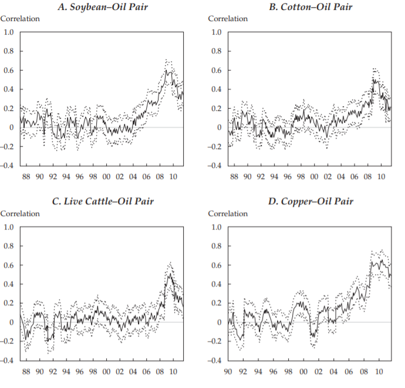
```

## Purpose of this Module

In this module we will not focus on the incentives for institutions to invest in commodities and we will also not examine the associated diversification benefits. Rather, we will look into the mechanics of index investing and examine the determinants of returns for long term index investors in commodity futures. You likely detected an inconsistency between the claim in the previous modules that futures prices are expected to remain flat over time (thus generating a zero expected return for investors) and the stylized facts that investors are including commodity futures into their portfolios at what appears to be an increasing rate. Empirical evidence is very clear that the long run average return to holding futures is close to zero. This being the case, is it only the diversification benefits which have attracted investors into holding commodity futures?

There is another reason why investment in commodity futures may be strong despite a lack of evidence that such investments are  profitable in the long run. Guided by professional trading blog sites and direct advice from financial advisors, many investors have come to incorrectly believe that the process of rolling an expiring futures contract into a new contract generates an instantaneous profit or loss. In years when strong short term demand cause soon-to-expire futures prices to rise faster than long-to-expire futures prices, the market goes into a stage of "backwardation" and roll yields become positive. In contrast, in years when weak short term demand cause soon-to-expire term futures prices to fall faster than long-to-expire futures prices, the market goes into a state of "contango" and roll yields become negative. Commodity investors typically earn a positive return in the first case because of rising commodity prices and not because of the positive roll yield. Conversely, investors typically earn a negative return in the second case because of falling commodity prices and not because of a negative roll yield.  

This negative correlation between market returns and the slope of the forward curve is likely one of the main reasons why investors rather easily buy into the so-called roll yield myth. Proponents of the myth believe that rolling a sequence of long futures contracts forward through time creates an instantaneous gain (backwardated market) or loss (contango market) which is proportional to the size of the roll. For example, if the long position in the March 2022 corn contract is offset and at the same time a new long position in the May 2022 contract is taken then proponents of the myth believe that the gain on the roll is equal to the March 2022 futures price minus the May 2022 futures price. The reasons why this logic is incorrect is discussed in more detail below.


The terms backwardation and contango are central in this module. The terms are defined more formally below but for now you can simply remember the following pair of definitions:

- A backwardated market is one for which the forward curve is downward sloping.
- A contango market is one for which the forward curve is upward sloping.

In the second half of this module futures and spot price data from the U.S. crude oil market is used to demonstrate empirically that roll yield is measuring the return from holding a futures contract relative to holding the spot commodity. After accounting for carrying costs, both the return from holding the spot commodity and the return from rolling futures through time are identical. This accurate interpretation of roll yield is very different than the roll yield myth interpretation.

Before examining the mechanics of index investing and roll yield, and demonstrating the falsehood of the roll yield myth, several popular commodity ETFs are examined.  

## Agricultural Commodity ETFs

Ordinary retail investors can gain exposure to agricultural commodity futures by investing in specialized agricultural commodity exchange traded funds (ETFs). The following [list](https://etfdb.com/etfs/natural-resources/agriculture/) shows that the most popular agriculture-specific ETF is the [Invesco DB Agricultural Fund](https://etfdb.com/etf/DBA/#etf-ticker-profile), formerly named Powershares DB Agricultural Fund. Created in 2007, and holding roughly \$100 million in assets, this ETF has generated a strong return in 2021 (about 22 percent). The Invesco DB Agriculture ETF is designed to follow a specialized non-traded index, and it is this index which is comprised of the specific returns from rolling long futures positions through time. The weights within the non-traded index are approximately 12 percent each for corn, live cattle, soybeans, sugar, cocoa and coffee, and the remaining percentage is allocated to hogs, wheat and cotton.

An important ETF which serves as both a direct investment and an index which other ETFs follow is the [Bloomberg Commodity Index](https://www.bloomberg.com/quote/BCOM:IND). According to a Bloomberg [press release](https://www.bloomberg.com/press-releases/2021-11-09/bloomberg-commodity-index-2022-target-weights-announced) assets which track the Bloomberg index are valued at roughly \$100 billion. The Bloomberg index tracks the prices of 23 physical commodities, about a third of which are agricultural-based. 

Figure \@ref(fig:bloombergindex) shows the current (December 2021) and proposed new composition of the Bloomberg Commodity Index (see press release for  more details). Notice that about 20 percent of the index is allocated to grains, about 22.5 percent to the soft commodities and about 5 percent to livestock. 
 
```{r bloombergindex, echo=FALSE, fig.cap = "Bloomberg Commodity Index Component Weights", fig.align='center', out.width = "65%"}
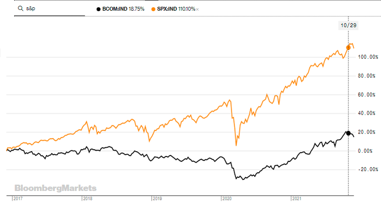
```

A highly specialized agricultural commodity investment is the  [Teucrium Corn ETF](https://www.teucrium.com/etfs/corn), which is designed to track corn futures only. This relatively small ETF had a return of nearly 40 percent on a net asset base of about \$135 million as of early December 2021. During this same time period the Teucrium Corn ETF held roughly an equal number of long positions in the March 2022, May 2022 and December 2022 corn contracts. The lack of diversification of this asset makes it relatively high risk to [hold](https://www.teucrium.com/holdings/corn).

To conclude this section it is useful to examine the historical performance of the Bloomberg Commodity Index. Figure \@ref(fig:bloombergindex-ts) shows the ETF price of the Bloomberg Commodity Index (black) and the S&P 500 Index (orange). It is clear that commodities performed quite poorly relative to the market as a whole between 2017 to early 2020. The strong growth in the Bloomberg index in 2021 has erased some of that poor performance but the overall performance of commodities as an investment remains weak.   

```{r bloombergindex-ts, echo=FALSE, fig.cap = "Bloomberg Commodity Index and S&P500", fig.align='center', out.width = "70%"}
knitr::include_graphics("Images/bloombergindex_ts.png")
```

## Simplified Roll Yield Assumption

To model roll yield and the roll yield myth, it is useful to focus on crude oil because unlike agricultural commodities in the crude oil futures market each month has its traded contract. The even spacing between rolls over the course of a year (i.e., one month) simplifies the calculations as compared to a corn contract which rolls with either a two month or three month span. The second reason why crude oil is easier to work with for the purpose of calculating roll yield is that there is no seasonality in prices. The lack of seasonality means that the size of the roll adjustment is expected to be relatively stable over time. With a storable agricultural commodity with annual production, the recurring seasonality results in the roll switching signs and varying in size over the course of a marketing year. 

The first simplification is that we will assume the crude oil ETF follows an index which measures the price changes in the next-to-expire futures contract for a single commodity (e.g., WTI crude). Moreover, we will assume the roll fully takes place on the last day before the futures contract expires. In real world markets, a crude oil ETF tracks an index which measures the prices of multiple futures contracts, and rolls well before the futures contract expires. For example, the [ProShares](https://www.proshares.com/funds/oilk_daily_holdings.html?gclid=Cj0KCQiAqbyNBhC2ARIsALDwAsDhGrKZ-promUu7Qn6-xpUD2wEiOwMnP_0V4Pc8kSC8Vvx456eSuxIaAs4dEALw_wcB) K-1 Free Crude Oil Strategy ETF tracks the Bloomberg Commodity Balanced WTI Crude Oil Index. As of December 7, 2021 this index had equal weightings in the March 2022, June 2022 and December 2022 crude oil futures. The specific rolling of this index is described as follows:

"The Bloomberg Commodity Balanced WTI Crude Oil Index (ticker: BCBCLI) aims to track the performance of three separate contract schedules for WTI crude oil futures, which are reset on a semiannual basis. One third of the index follows a monthly roll schedule that rolls from the current futures contract (which expires one month out) into the following month’s contract; the second third of the index is designated to be in a June contract and follows an annual roll schedule in March of each year; and the remaining third is designated to be in a December contract and follows an annual roll schedule in September of each year."

The simplified roll structure that we assume allows us to easily measure the roll yield and show how roll yield is a measure of the differential performance of the spot price of crude oil and the futures price. Like most economic models, the goal is to remove the less important assumptions which tend to make the analysis excessively complicated and which add very little by way of economic insight. 

## The Roll Yield Myth

In the following [blog site](https://www.etf.com/publications/journalofindexes/joi-articles/12274-better-beta-in-commodities-indexing.html), the author assumes a simplified roll structure similar to the one used for this module. Specifically, the index is assumed to measure the earnings of a hypothetical investor who rolls over each month the next-to-expire crude oil futures contract.  Figure \@ref(fig:etf-rollyield) shows the specific roll structure. For example, the second row shows that on January 14th the February futures is sold and the March futures is purchased. The third row shows that on February 15th the March futures is sold and the April futures is purchased. The last column shows the calculated roll yield, which is the price of the expiring contract minus the price of the new contract.

```{r etf-rollyield, echo=FALSE, fig.cap = "Calculation of Roll Yield in the Crude Oil Market", fig.align='center', out.width = "80%"}
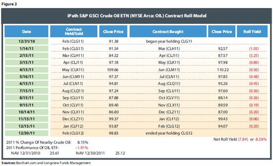
```

In this particular case, the market is in contango since the price of the new contract is consistently higher than the price of the old contract (i.e., the forward curve is upward sloping). Later in this module the opposite scenario of market backwardation is considered, in which case the forward curve is downward sloping. 

At the bottom of Figure \@ref(fig:etf-rollyield) the authors add up the monthly roll yields and obtain a net roll yield equal to -\$7.84/barrel. They interpret this value as representing a -8.58 percent financial loss for the hypothetical investor. The authors conclude that holding a crude oil ETF when the market is in a state of contango typically leads to losses. In contrast, in those years when the market was in a state of backwardation the roll yield is positive and investors should expect a positive return.

Academics have pointed out that the logic in the previous paragraph is incorrect. The roll yield does not measure a financial loss or gain but rather is a measure of the performance of the futures price relative to the spot price. Specifically, when the roll yield is negative in a contango market the index of joined futures prices lies below the spot price and so the futures market is under performing relative to the spot price. In the opposite case where the roll yield is positive in a backwardated market, the index of joined futures lies above the spot price and so the futures market is over performing relative to the spot market. Some trading professionals who understand the correct interpretation of roll yield as a differential measure of performance in the futures and spot market use this differential to conceptually link poor returns to contango markets and strong returns to backwardated markets. This line of thinking is also faulty because it fails to account for the carrying charges which are being incurred by those who hold the spot commodity (more on this below).

In summary, there are two incorrect beliefs about roll yield. The first is highlighted in Figure \@ref(fig:etf-rollyield) where some investors believe that each specific roll generates a direct financial loss. The incorrect belief is that it is okay to measure the financial performance of commodity futures by determining if the performance is better or worse than the return which could be earned by holding the spot commodity. If the full carrying costs were subtracted from roll yield then it would be acceptable to assess roll yield as a financial return. In real world investing it is not possible to obtain information on the cost of carrying the spot commodity and as result roll yield is not generally a useful measure of financial performance in commodity futures markets.

Academics have collectively labeled both types of incorrect beliefs about roll yield as "the roll yield myth". Unfortunately, this myth is widespread. For example, in December of 2021 if you Google "contango and investor returns" the first link which is returned is a newsletter by [Fidelity](https://www.fidelity.com/learning-center/investment-products/etf/commodity-etfs-contango-backwardation) titled "Commodity ETFs: A guide to contango and backwardation". This newsletter notes the following:

"If each subsequent month on the futures "curve" is priced higher than preceding months, a commodity is said to be in contango. The opposite situation—when subsequent months are priced lower than preceding months—is called backwardation.... An ETF that employs a basic strategy of investing in the front-month futures contract of a given commodity, for example, will either see its returns decrease in the case of contango or increase in the case of backwardation... These roll costs can be substantial. A 1% monthly cost comes to a nearly 13% cost on an annualized basis. That could wipe out any gains in the spot price, or similarly, exacerbate any losses in the spot price. "

## A Formal Definition of Backwardation and Contango

In earlier modules we referred extensively to the slope of the forward curve. In this module we follow the industry naming convention:

- A market with a downward sloping forward curve is a  backwardated market.
- A market with an upward sloping forward curve is a contango market.

For the case of a storable agricultural commodities with a once per year harvest (e.g., corn) it is often difficult to distinguish between a backwardated market and a contango market due to the saw-toothed pricing pattern which is typically embedded in the forward curve. Specifically, the forward curve typically shows short term backwardation with the arrival of new harvest and short term contango in the post-harvest period. To avoid this problem we will use data from the crude oil market to calculate and compare roll yield in a backwardated market versus a contango market.

Recall that a futures price is a measure of the spot price in Chicago when the futures contract expires. Figure \@ref(fig:backwardation) shows the case of a backwardated market. Notice that the spot price is expected to decline over time because of a negative carrying charge (i.e., a high convenience yield). Times $T_1$, $T_2$ and $T_3$ on the horizontal axis represents the expiry dates of the nearest three futures contracts. The vertical axis shows a mapping of the expected spot prices at these three dates. These expected spot prices are also the date 0 futures prices. This means the prices along the vertical axis is a graph (of sorts) of the forward curve. The fact that futures prices are lower for contracts with more distant expiry dates (i.e., the forward curve slopes down) confirms that this market is in backwardation.

 
```{r backwardation, echo=FALSE, fig.cap = "Expected Spot Price Path and Forward Curve with Backwardation", fig.align='center', out.width = "86%"}
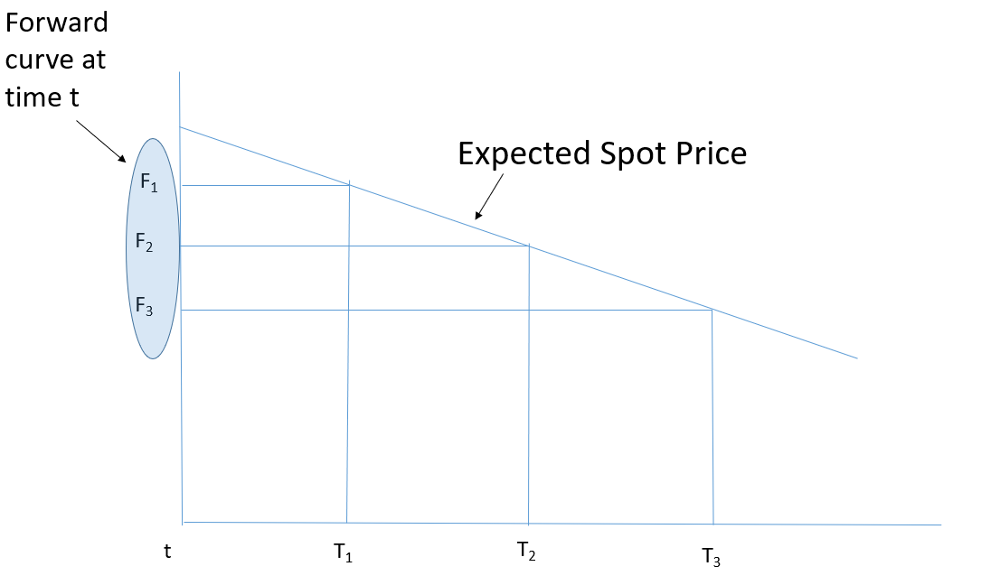
```

Figure \@ref(fig:contango) shows the case of a contango market. The graph is the same as the previous case except now we expect the spot price to rise over time due to a positive carrying charge. In this case the forward curve which is mapped on the vertical axis shows a higher futures price for contracts with a more distant expiry. This upward sloping pattern confirms the existence of a contango market.


```{r contango, echo=FALSE, fig.cap = "Expected Spot Price Path and Forward Curve with Contango", fig.align='center', out.width = "90%"}
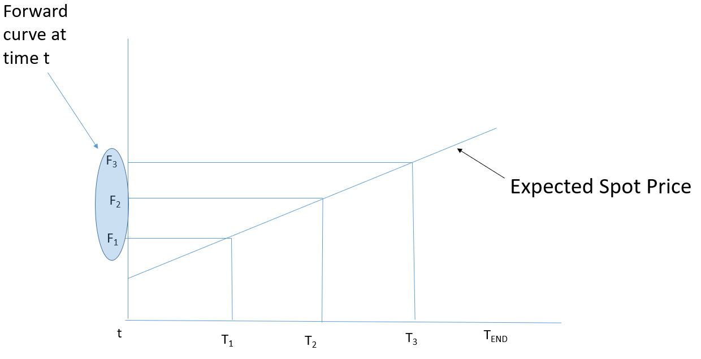
```

## Backwardation and Contango in the Corn Market

Even though the case study below features crude oil it is useful to discuss two recent cases of pronounced backwardation and contango in the corn market. Figure \@ref(fig:corn-20) shows the futures prices of the eight closest corn contracts on July 2, 2020. The months the contracts expire are the labels on the horizontal axis. Note that "Jul_0" stands for the "old crop" July contract (i.e., July 2020) and "Jul_N" stands for the "new crop" July contract (i.e., July 2021). The other labels have a similar interpretation. Figure \@ref(fig:corn-21) shows the futures prices of the eight closest corn contracts on June 2, 2021. In this case the horizontal axis labels correspond to the old crop contracts in 2021 and to the new crop contracts in 2022.

:::: {.columns}

::: {.column width="50%"}
```{r corn-20, echo=FALSE, fig.cap = "Contango (July 2020) in CME Corn Futures", fig.align='center', out.width = "83%"}
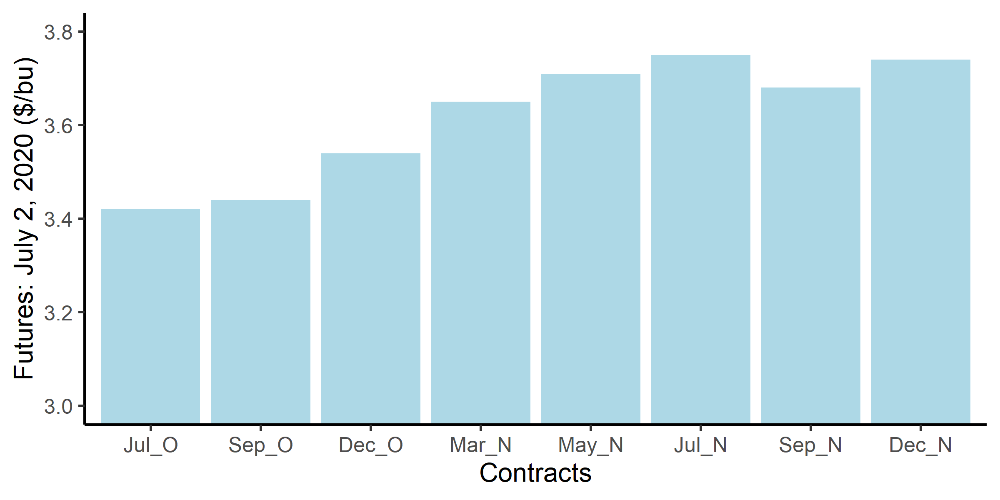
```
:::

::: {.column width="50%"}
```{r corn-21, echo=FALSE, fig.cap = "Backwardation (June 2021) in CME Corn Futures", fig.align='center', out.width = "83%"}
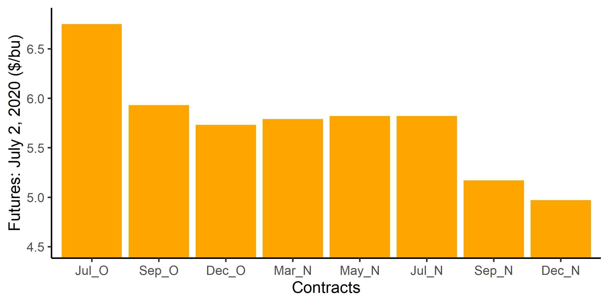
```
:::

::::

It is obvious that the corn market was in a state of contango in July of 2020, and was in a state of backwardation in June of 2021. The reason for these two different outcomes in less than a years time can be described as follows. In July of 2020 the reality of the COVID-19 was sinking in and the global demand for commodities had slumped. Indeed, in July of 2020 the price of oil had recently traded in negative territory for the first time in history. The contango in the corn market reflected the relative glut of corn in the old crop year, and thus the cost of carrying this glut of corn forward to the new crop year. Another way of viewing this problem is that demand for corn was expected to gradually strengthen over time and this belief revealed itself as an upward sloping forward curve.

In contrast, Figure \@ref(fig:corn-21) shows that the corn market was in a state of backwardation in June of 2021. In this case the global lockdown from COVID-19 was easing and there was strong pent up demand for commodities. The surge in short term demand resulted in high convenience yield, which is a market signal that corn should be sold immediately rather than stored for future sale. Another way of viewing this problem is that corn stocks were tight in the spring of 2021 due to the high demand, but with the arrival of the new corn crop in the fall of 2021 prices were expected to fall. This current shortage, which will diminish with the arrival of new stocks, revealed itself as a downward sloping forward curve.

## Roll Yield Case Study: Crude Oil

In this section we will use spot and futures prices from the WTI crude oil market to calculate the roll yield for a backwardation time period and for a contango time period. Once we have calculated the roll yield we will demonstrate that roll yield is simply a measure of the arbitrage-enforced relationship between the prices in the spot and futures markets. After establishing what the roll yield actually is we will confront the roll yield myth and further discuss why the claims associated with this myth are incorrect. 

In professional trading the term "roll yield" is often used rather loosely. For example, the last column in Figure \@ref(fig:etf-rollyield) refers to the price of the expiring futures contract minus the price of the new futures contract as roll yield, and the sum of the individual roll yields as the net roll yield. In this module we will refer to the price difference of the expiring and new contract as the roll adjustment and the sum of all roll adjustments over the time period under consideration as the roll yield. Of course, if there is just one roll then the roll adjustment is equal to the roll yield. 

### Data

Spot prices for WTI crude oil come from the [U.S. E.I.A.](https://www.eia.gov/dnav/pet/hist/rwtcD.htm). Futures prices for WTI crude oil come the price history tab of Barchart. Two relatively short periods of time were chosen for the analysis. The first period runs from October of 2018 to February of 2019 (five months) and the second period runs from July of 2021 to November of 2021 (five months). The spot price is measured FOB Cushings Nebraska, and this is also the delivery location for the WTI crude oil futures. This means that no location adjustment is required when comparing the spot price to the futures price. Arbitrage ensures that the spot price and futures price are equal when a futures contract expires. This means we can interpret the spot price as the price of an expiring futures contract. With this interpretation the spot price is the first price in the crude oil forward curve.

#### Crude Oil Market in Contango

Figure \@ref(fig:wti-contango) shows for the first of the two time periods (i.e., October of 2018 to February of 2019) the March 2019 crude oil futures as well as the basis which was calculated with the March 2019 contract. Over the first half of this period the March 2019 futures fell from about \$70/barrel to \$45/barrel and stayed largely flat thereafter. More importantly, Figure \@ref(fig:wti-contango) shows that the basis was negative over the full time period. A negative basis implies that the price of an expiring futures contract is less than the price of the March 2019 contract. For this reason we should expect the crude oil market to be in contango with an upward sloping forward curve. Figure \@ref(fig:wti-forward-contango), which is a plot of the forward curve on October 22nd, shows that this is indeed the case. The scale of the vertical axis can be deceiving. In reality the slope of the crude oil forward curve during this time period is very small.

:::: {.columns}

::: {.column width="50%"}
```{r wti-contango, echo=FALSE, fig.cap = "WTI Crude Oil Basis **with Contango**", fig.align='center', out.width = "100%"}
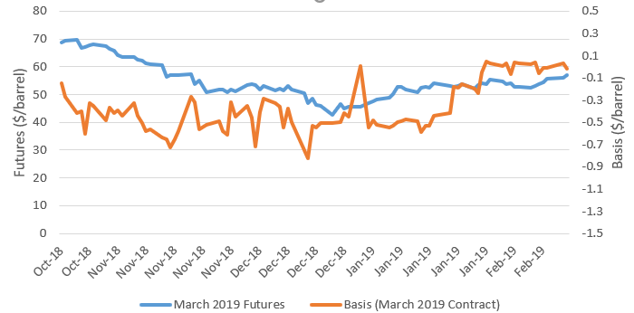
```
:::

:::{.column width="50%"}
```{r wti-forward-contango, echo=FALSE, fig.cap = "WTI Crude Oil Futures **with Contango**", fig.align='center', out.width = "100%"}
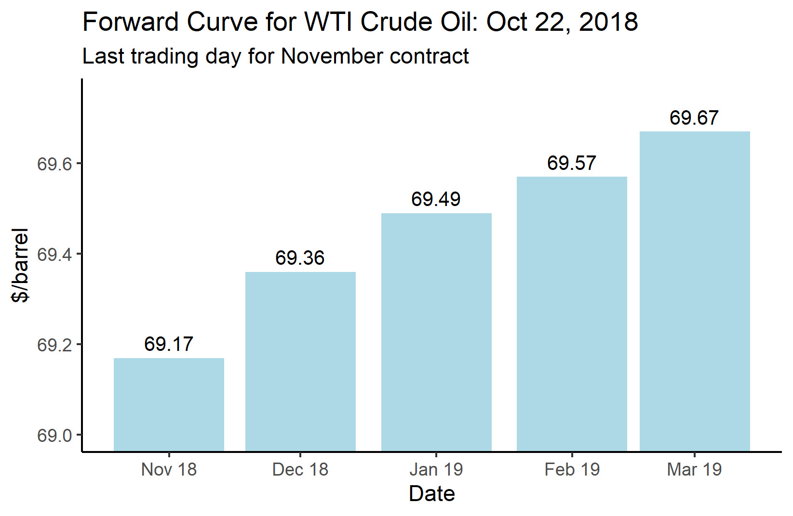
```
:::

::::

#### Crude Oil Market in Backwardation
Figure \@ref(fig:wti-backwardation) shows the WTI Basis and March 2021 futures for the July 2021 to November 2021 period. The price of crude oil surged upward earlier in 2021 and it has remained at around \$70/barrel throughout the July to November time period. Previously we showed that the corn market was in backwardation during this time period, and we explained the reasons for the backwardation. The positive crude oil basis in Figure \@ref(fig:wti-backwardation) and the downward sloping crude oil forward curve in Figure \@ref(fig:wti-forward-backwardation) confirms that indeed the crude oil market was backwardated between July and November of 2021. The reasons for the backwardation are similar to those identified for the backwardated corn market. 

:::: {.columns}

::: {.column width="50%"}
```{r wti-backwardation, echo=FALSE, fig.cap = "WTI Crude Oil Basis **with Backwardation**", fig.align='center', out.width = "100%"}
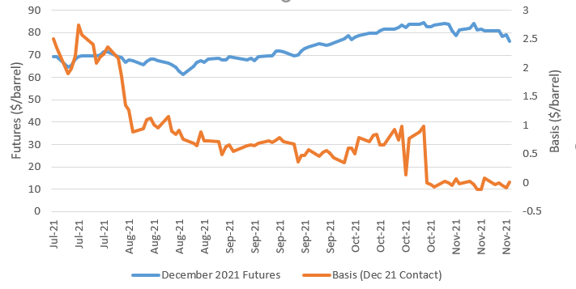
```
:::

:::{.column width="50%"}
```{r wti-forward-backwardation, echo=FALSE, fig.cap = "WTI Crude Oil Futures **with Backwardation**", fig.align='center', out.width = "100%"}
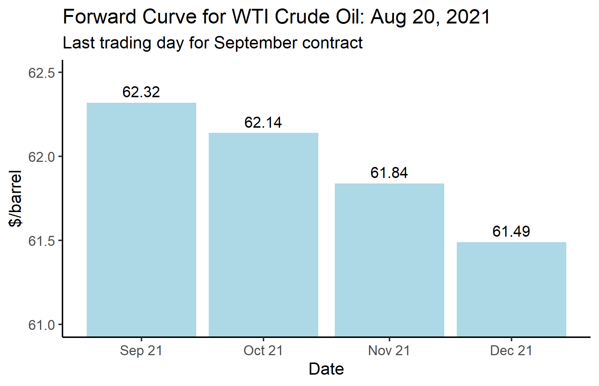
```
:::

::::

### Constructing a Joined Futures Price Series

Our goal in this section is to join together the prices of the five monthly futures contracts which trade in the October 2018 to February 2019 period, and in the July to November 2021 period. The joined price series is equivalent to an index which tracks the earnings of a hypothetical investor who rolls a series of long positions through time. For example, on October 18, 2018 the investor is assumed to take a long position in the November crude oil futures. On October 22nd the November contract is closed and a new position in the December contract is picked up. The method of taking a long position in the "back" contract, holding it until the contract expires and then shifting the long position into the "front" contract is referred to as rolling. In this case study, rolls are assumed to happen on approximately the 20th day of the month preceding the contract expiry month. 

### Illustrative Example 

```{r, echo = F}

# read the data
roll1 <- readRDS(here("Data", "roll1.RDS"))
roll2 <- readRDS(here("Data", "roll2.RDS"))
```


Table \@ref(tab:example1) contains artificial prices for three hypothetical futures contracts which trade each day for seven consecutive days. The prices in Table \@ref(tab:example1) are used to show how the roll adjustments are calculated and how the joined futures price series is created. On days 1 through 3 the joined futures series in the last column track the prices of the *Fut1* contract in the first column. On day 3 we see the roll from the *Fut1* back contract to the *Fut2* front contract takes place. In the third row of the third (Roll12) column the difference between the day 3 back price (69.17) and the day 3 front price (68.49) is entered. This 0.68 value is the roll adjustment between the first and second contracts. This roll adjustment in the Roll12 column is copied down to row 4, which is the day before the next roll adjustment.

```{r, example1, echo = F}
kable(roll1, digits = 3, caption = "Example of Roll Yield Calculation", align = 'c') %>% kable_styling(full_width = F)
```

The next roll adjustment in Table \@ref(tab:example1) takes place on day 5. In the fifth row of the fifth column (Roll23) the difference between the day 5 back price (*Fut2* = 65.96) and the day 5 front price (*Fut3* = 64.91) is entered. This 1.05 roll adjustment between the second and third contracts, is copied down to day 7, which is the end of the pricing period. The middle column in Table \@ref(tab:example1), which is titled *Roll*, combines the days 1 and 2 roll adjustments (equal to zero), the days 3 and 4 roll adjustments (from the *Roll12* column) and the days 5, 6 and 7 roll adjustments (from the *Roll22* column).

There are three remaining steps which are required to calculate the joined futures series. The third column from the right in Table \@ref(tab:example1), titled *CumRoll*, is the cumulative roll adjustments. It is calculated by maintaining a running total of the individually-calculated roll adjustments from the *Roll* column. The second column from the right, called *Front*, contains the prices of the current (i.e., next to expire) futures contracts. In other words, this column contains all of the most recent front prices. Most importantly, the last column is the desired joined futures price sequence. It is calculated by adding the values in the *CumRoll* column to the front futures prices in the *Front* column. The value of the cumulative roll adjustments when the time period ends is the roll yield, which is central to this analysis.

Earlier we claimed that if one investor rolled a long futures position through the investment period and a second investor held the joined futures, which was made available as an index, then the return which is earned by the two investors must be equal. We can use the example in Table \@ref(tab:example1) to verify this outcome. Table \@ref(tab:example2) shows the contract-by-contract gains and losses for the investor who rolls the long position through the seven day time period. The first buy-sell transaction is for the investor who takes a long position in *Fut1* on day 1 at price 68.65 and offsets it on day 3 at price 69.17. On this same day the investor takes a long position in *Fut2* at price 68.49. This rolling of the long futures continues until the *Fut3* contract is offset on day 7.

The last column of Table \@ref(tab:example1) shows the profit on each buy-sell transaction. If we add these individual profits and losses together we see that the investor would have lost 1.98 per barrel. Now consider the investor who holds the joined futures series in the form of an index. The investor is assume to buy into the index on day 1 at price at 68.65 and to sell her position in the index on day 7 at price 66.71. Subtracting the first value from the latter value shows that this investor would have earned -1.98 per barrel. As predicted, the gain/loss is identical for the two investors. The reason for this outcome is explained below.


```{r, example2, echo = F}
kable(roll2, digits = 3, caption = "Profits on Individual Futures Transactions", align = 'c') %>% kable_styling(full_width = F)
```

## Backwardation

In this section we will construct the joined futures price series for crude oil and then use it to compute the roll yield for the July to November 2021 backwardated time period. Following the procedure used in the illustrative example, step one is to construct the joined futures series. Step 2 is to verify that we constructed the joined price series correctly by comparing its return to that of a hypothetical investor who continually rolls forward a long futures position. Step 3 is the most important because it is here where the spot price is incorporated into the analysis and we prove the rather remarkable result that our measure of roll yield (which is the final value of the cumulative roll adjustments) is also a measure of the return from holding futures minus the return from holding the spot commodity. This outcome is remarkable in the sense that there is no obvious connection between the individual roll adjustments in the futures market and a relationship between the differential return from holding futures versus the spot commodity. 

### Step 1: Construct Joined Futures

To focus on a backwardated crude oil market we restrict our attention to the July to November 2021 period.  Table \@ref(tab:joined-futures) shows the daily prices with various rows hidden to limit the size of the table. On July 15,2021 (top row) the joined series in the right column begins tracking the price of the August 2021 futures contract, The August contract expires five days later (on July 20th) and so this is the day within which the first roll yield is calculated, and when the September futures replaces the August futures as the front contract. Working down the columns, the roll from the September to October contract takes place on August 20th, and the roll from the October to November contract takes place on September 21. The last roll from the November to the December contract takes place on October 20.


```{r, joined-futures, echo = F}
combined_21 <- readRDS(here("Data", "combined_21.RDS"))

options(knitr.kable.NA ='')

combined_21 %>% select(time, spot, aug_21:dec_21, cum_roll, joined) %>%
  filter((time >= "2021-07-15" & time <= "2021-07-21") | 
           (time >= "2021-08-19" & time <= "2021-08-23") | 
           (time >= "2021-09-20" & time <= "2021-09-22") | 
           (time >= "2021-10-19" & time <= "2021-10-21") | 
           time == "2021-11-19") %>% 
  mutate(cum_roll = cell_spec(round(cum_roll, 2), align = "center", 
                              color = ifelse(time == "2021-07-20" |
                                               time == "2021-08-20"|
                                               time == "2021-09-21" |
                                               time == "2021-10-20", "red", "black"))) %>%
  # escape = F will need to work for the conditional color formatting
  kbl(escape = F, 
      col.names = c("Time", "Spot", "Aug 21", "Sep 21", "Oct 21", "Nov 21", "Dec 21", "Cum Roll", "Joined"), caption = "Joined Futures with Backwardation Data", 
      align = 'c') %>% 
  kable_styling(full_width = F)
```

The second last column in Table \@ref(tab:joined-futures) shows the cumulative roll adjustments. The first adjustment of 0.22 corresponds to the August to September futures contract roll. The second adjustment of 0.40 - 0.22 = 0.28 corresponds to the September to October roll. The final adjustment on October 20th, which corresponds to the November to December contract roll, brings the cumulative roll adjustment up to 0.92. This final value of the cumulative roll adjustment is the roll yield for this particular time period.

Following the procedure in the simplifying example, the cumulative roll adjustments are added to the current front futures prices to obtain the sequence of joined futures prices, which are shown in the last column of Table \@ref(tab:joined-futures). The positive values of the cumulative roll adjustments make it clear that the crude oil market is in backwardation throughout the July to November 2021 period.  

### Step 2: Verify Joined Futures Returns 

In this section we want to verify that if an investor holds an exchange traded fund (ETF) which perfectly tracks the joined futures price which resides in the last column of Table \@ref(tab:joined-futures) then that investor must earn the same as another investor who continually rolls long futures contracts through time. Suppose Investor A takes a long position in the joined futures at the July 15, 2021 beginning date and offsets this position at the November 19, 2021 ending date. In contrast, investor B rolls a long futures position through the five futures contracts, replacing the long position in the back contract with a long position in the front contract when the back contract expires. 

Tables \@ref(tab:investorA) and \@ref(tab:investorB) show how profits are calculated for the two investors, and also verifies that each investor earns the same amount, 5.37, over the July to November time period.

```{r, investorA, echo = F}
investor_a <- readRDS(here("Data", "investor_a.RDS"))

investor_a %>% kbl(caption = "Investor A") %>% kable_styling(full_width = F) %>% row_spec(3, bold = T)
```

```{r, investorB, echo = F}
investor_b <- readRDS(here("Data", "investor_b.RDS"))

investor_b %>% kbl(caption = "Investor B") %>% kable_styling(full_width = F) %>% row_spec(6, bold = T)
```

### Step 3: Alternative Interpretation of Roll Yield 

In this section we prove the rather remarkable result that the roll yield, which is the final value in the time period of the cumulative roll adjustment, is equal to the return from holding futures minus the return from holding the spot commodity. The second column of Table \@ref(tab:joined-futures) shows the spot price of crude oil over the July to November 2021 backwardation period. Arbitrage ensures that the spot price is equal to the price of the expiring futures contract. To verify that this is the case, notice that on July 15, the 71.67 spot price is very close to the 71.65 price of the expiring August futures contract. Similarly, on August 20 the 62.25 spot price is very close to the 62.32 price of the expiring September futures contract. At the closing time period on November 19, the spot price and the expiring December futures price are both equal to 76.1.

The first column in Table \@ref(tab:return-compare) shows that the spot price increased from 71.67 to 76.11 over the full July to November 2021 backwardation period. The last column in the Table \@ref(tab:return-compare) shows that the joined futures increased from 71.65 to 77.02 over the backwardation period. Because these two price series have the same starting value, we can intepret the difference in the ending values, 77.02 - 76.11, as the excess return from holding futures over holding the spot commodity. This difference of 0.93 is the same (approximately) as the 0.92 value of the roll yield, which is displayed at the bottom of the second last column in Table \@ref(tab:return-compare). We can therefore conclude that:

$$\text{Roll Yield} = \text{Return from Holding Futures} - \text{Return from Holding Spot} $$

```{r return-compare, echo = F}
options(knitr.kable.NA ='') # this converts NA to empty string

combined_21 %>% select(time, spot, aug_21:dec_21, cum_roll, joined) %>%
  filter(time == "2021-07-15" | time == "2021-07-16" |
           time == "2021-11-18" | time == "2021-11-19") %>% 
  # conditional formatting 
  mutate(spot = cell_spec(round(spot, 2), align = "center", 
                          background = ifelse(time == "2021-07-15" | time == "2021-11-19",
                                              "green", "white"),
                          color = ifelse(time == "2021-07-15" | time == "2021-11-19", 
                                         "white", "black"))) %>%
  mutate(aug_21 = replace_na(aug_21, '')) %>% 
  mutate(aug_21 = cell_spec(aug_21, align = "center",
                            background = ifelse(time == "2021-07-15", "green", "white"),
                            color = ifelse(time == "2021-07-15", "white", "black"))) %>%
  mutate(dec_21 = cell_spec(round(dec_21, 2), align = "center",
                            background = ifelse(time == "2021-11-19", "green", "white"),
                            color = ifelse(time == "2021-11-19", "white", "black"))) %>%
  mutate(joined = cell_spec(round(joined, 2), align = "center",
                            background = ifelse(time == "2021-07-15" | time == "2021-11-19",
                                                "orange", "white"),
                            color = ifelse(time == "2021-07-15" | time == "2021-11-19", "white", "black"))) %>%
  # escape = F will need to work for the conditional color formatting
  kbl(escape = F, 
      col.names = c("Time", "Spot", "Aug 21", "Sep 21", "Oct 21", "Nov 21", "Dec 21", "Cum Roll", "Joined"), 
      caption = "Comparing Investor A's and B's return") %>% 
  kable_styling(full_width = F)
```

To conclude this section, Figure \@ref(fig:back-futures-spot) shows the time path of the spot price (blue) and joined futures (orange) over the last two thirds of the period in question (the graph was truncated in order to better show the gap between the two price series). This graph shows the gap between the joined futures and the spot price is growing over time due to the ever increasing cumulative roll adjustment. The final gap between the spot and joined futures is equal to  `r combined_21$joined[combined_21$time == "2021-11-19"]` - `r combined_21$spot[combined_21$time == "2021-11-19"]` = `r combined_21$joined[combined_21$time == "2021-11-19"] - combined_21$spot[combined_21$time == "2021-11-19"]`, which is roughly equal to the `r combined_21$cum_roll[combined_21$time == "2021-10-20"]` cumulative roll yield shown in Table \@ref(tab:return-compare). 

```{r back-futures-spot, echo=FALSE, fig.cap = "Joined Futures vs. Spot Price in a Backwardated Market (July 2021 - Nov 2021)", fig.align='center', out.width = "60%"}
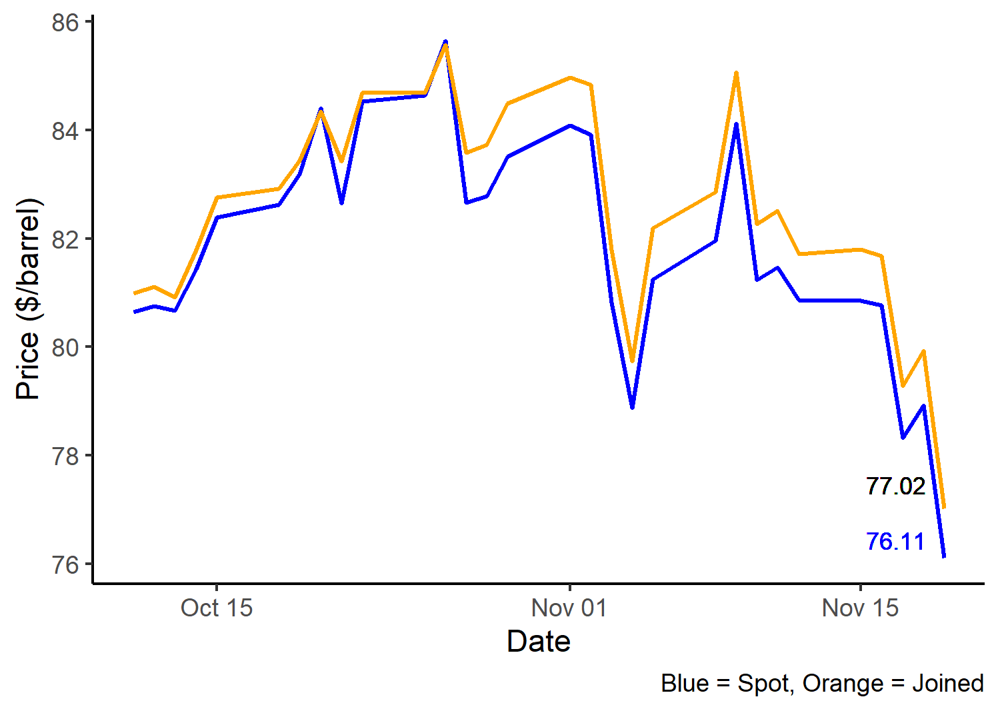
```

## Contango Market

We will not repeat all the steps for deriving the joined futures price series and the roll yield for the October 2018 to February 2019 time period, which is when the crude oil market was in a state of contango. The summary statistics are as follows:

- On October 18, 2018 (beginning of period) the November futures is about to expire, and so the 68.63 spot price is very close to the 68.65 joined futures price
- The roll adjustments are equal to: -0.19 for the November to December roll, -0.44 for the December to January roll, -0.97 for the January to February roll and -0.44 for the February to March roll.
- The cumulative roll adjustment and thus the roll yield totaled -2.04 over the October to February time period.
- The spot price finished the time period at 56.90, and the joined futures finished the time period at 54.88.
- The return from holding futures minus the return from holding the spot commodity is equal to (54.88 - 68.65) - (56.90 - 68.63) = -2.04
- This excess return for holding the futures is exactly equal to the -2.04 roll yield (which is also the cumulative roll adjustment). 

Figure \@ref(fig:con-futures-spot) shows the time path of the crude oil joined futures price series and the crude oil spot price over the last two thirds of the October 2018 to February to 2019 time period (the first third of the graph was omitted to better emphasize the gap between the two price series). As was expected given the summary statistics presented above, in this contango market the spot price dominates the joined futures price and the gap is growing over time. By the end of the time period (February 2019) the joined futures price minus the spot price is given by 54.88 - 56.90, which is -2.04. As highlighted above, this pricing gap matches the roll yield, as was shown in the summary statistics (see above).

```{r con-futures-spot, echo=FALSE, fig.cap = "Joined Futures vs. Spot Price in a Contango Market (Oct 2018 - Feb 2019)", fig.align='center', out.width = "60%"}
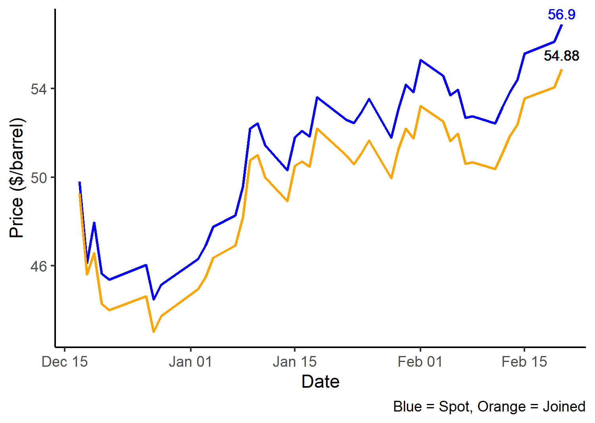
```

Figure \@ref(fig:con-futures-spot) has an alternative interpretation. In the previous modules we emphasized that the expected futures price does not change over time because there is essentially no cost of holding futures for a risk neutral investor. In contrast, in a contango market we saw that the expected spot price increases over time in order to cover the carrying cost of grain merchants who were storing the commodity. We noted that the gap between the expected futures price and the Chicago spot price was a measures of the carrying cost from the current time period until the futures contract expires.

We can use this same logic to interpret Figure \@ref(fig:con-futures-spot). If we were to shift the spot price schedule down (parallel) so that the spot price and joined futures price were equal at the end of the time period, then our revised graph would have the -2.04 gap at the beginning of the time series rather than at the end of the time series. This -2.04 gap at the beginning of the time series can then be interpreted as the carrying cost between the October 2018 beginning of the time period to the February 2019 end of the time period. 
We now have a new result to emphasize:

- In a contango market the roll yield, which was shown to equal the return from holding futures minus the return from holding the spot, is equal to the negative of the cost of carrying the commodity.

A different version of this same result is as follows:

- In a contango market, the difference in the return for an investor holding the spot commodity versus an investor who is rolling long futures through time is equal to the cost of carrying the commodity through time.

This last result emphasizes that roll yield is essentially a dynamic equilibrium condition which eliminates the possibility for arbitrage across the spot and futures markets. Indeed, after accounting for the carrying costs the investor who holds the spot commodity earns exactly the same return as the investor who holds an exchange traded fund (ETF) which tracks the changes in the joined futures price over time.

There is an analogous result in the backwardation market but the interpretation is less clear cut. In a contango market, after accounting for the convenience yield of the grain merchant, the return from holding the commodity in the spot market is exactly equal to the return from holding an ETF which tracks the movements in the joined futures price over time.

## Roll Yield Myth Revisited

Earlier in this module we saw there are two levels of the roll yield myth. First, some investors believe that rolling from one contract to another locks in a profit if the price gap/roll adjustment is positive and locks in  a loss if the price gap/roll adjustment is negative. Second, some investors incorrectly interpret roll yield as a financial yield rather than as the difference in the return from holding a rolling long futures position versus holding the spot commodity. Interpreting roll yield as a financial return is acceptable only if the carrying costs in the spot market are accounted for.

Those who believe in the first level of the myth would look at the positive roll yields in Table \@ref(tab:joined-futures) and believe that the positive overfall returns in the July to November 2021 crude oil market can be partially attributed to these positive returns. This of course is wrong because when evaluating the profitability of a rolling long futures position it is necessary to subtract the price when the long position was initiated from the offset price. The price difference between the back contract and the front contract should not be interpreted as a financial gain or loss.

Those who believe in the second level of the myth are correct in their understanding that the roll yield is a measure of the return from holding futures relative to the return from holding the spot commodity. These myth believers would point to the graphs of the joined futures and spot prices of crude oil in Figures \@ref(fig:back-futures-spot) and \@ref(fig:con-futures-spot) and then argue that investing in a backwardated market when the joined futures price is above the spot price is more profitable than investing in a contango market when the joined futures price is below the spot price. These investors are failing to realize that roll yield is an equilibrium concept which ensures that the net return to holding the spot commodity after accounting for carrying costs is exactly equal to the return from rolling long futures contracts forward through time.

## Summary and Conclusions

Institutional and retail level investment in commodity futures has grown rapidly over the past 20 years and is very likely to remain important in the years to come. This financialization of commodity markets is especially important for agricultural commodities. Policy makers are concerned because with financializationn the price volatility in the general market for equities spills into agricultural markets and in doing so further exacerbates prices which are inherently  unstable.  In the aftermath of the 2007 - 2008 food price crisis financialization was hypothesized to be the main cause of the price surge, and there was a growing call for restrictions to be imposed on outside investment in agricultural commodity futures (watch short [video](https://www.youtube.com/watch?v=aSKiDFPWJA0) by Michael Masters). Careful empirical analysis has found little evidence which supports this claim but the belief that financialization is destablizing food markets continues to be popular.

This module has highlighted a weakness of an underlying assumption concerning commodity futures. Specifically, it is generally assumed that the futures price is equal to the expected value of the spot price when the futures contract expires, and as such the expected return from holding futures is equal to zero. Even though very little capital is required to take a position in the futures market, taking such a position results in considerable risk for the investor. Why would an investor maintain a long position with zero expected return if her or she could instead earn a small (perfectly safe) positive return by investing in savings bond? Extensive empirical work has demonstrated that long returns from holding futures are generally quite small, which is consistent with our assumption that the expected futures price is constant over time. On the other hand, it is hard to understand why billion of dollars are being invested in commodity futures in light of such small returns. Unfortunately, this course has no good answer for this conundrum. 