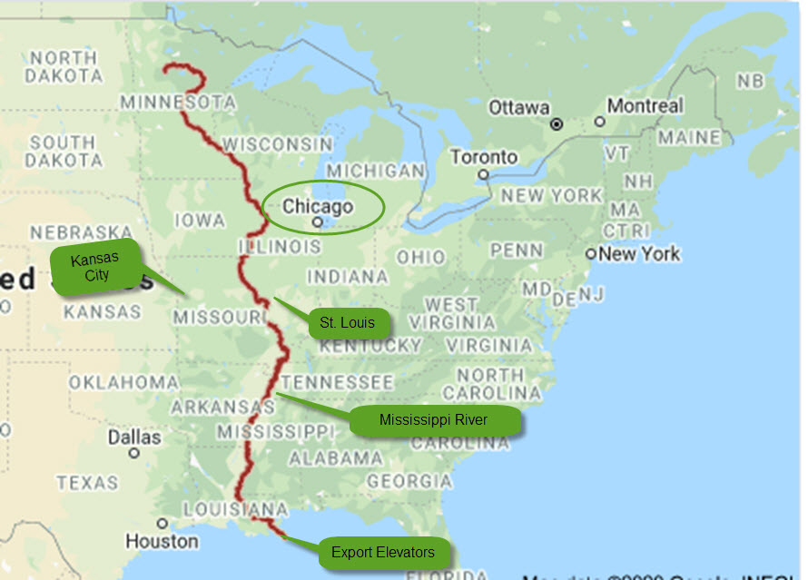
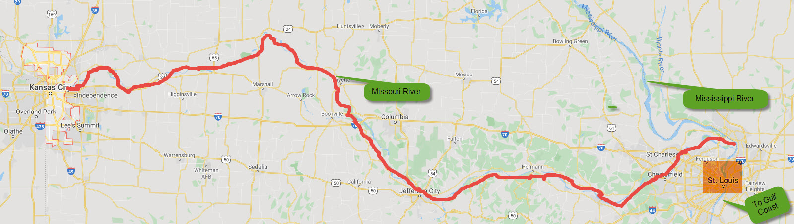

---
output:
  word_document: default
  html_document: default
---

# Spatial Basis

## Background
In the previous module we calculated the corn basis assuming that the spot market for corn is located in Chicago, which is the delivery location for corn futures contracts. In this module we focus on basis in the more general case where the spot market is located in the U.S. Midwest. In this situation we must factor transportation costs into the calculation of basis. This module uses a combination of the spatial LOP and intertemporal LOP to derive the equilbrium spot and futures prices.

Agricultural commodities such as wheat, corn and soybeans which are produced in the U.S. midwest are both processed locally and exported. A major export route is the Mississippi River, as shown by the dark red line in the image below. We will focus on the basis in the Kansas City spot market. Specifically, we are interested in the Kansas City spot price for corn minus the corn futures price. We assume that corn grown in the Kansas City region is first shipped to St. Louis either by train or by barge on the Missouri River. After arriving in St. Louis the corn is transferred to a barge and floated down the Mississippi River to an export port at the U.S. Gulf.
 

 ```{r, echo=FALSE, out.width="50%", fig.cap="Kansas City Corn Export Route"}

```

 ```{r, echo=FALSE, out.width="70%", fig.cap="Kansas City to St. Louis."}

```
## Theory
It probably seems strange to have Chicago as the delivery location for U.S. corn contracts. It would make more sense to have Stl Louis as the the delivery location because St. Louis is the hub when corn is shipped from the U.S. Midwest to the export ports located at the U.S. Gulf Coast. It turns out the corn futures contract specifies St. Louis as an alternative delivery location. If you check out rule 10105 in the CBOT corn futures rule book (https://www.cmegroup.com/content/dam/cmegroup/rulebook/CBOT/I/10.pdf ) you will see that corn delivered to St. Louis instead of the Chicago earns a premium of 16.25 cents per bushel over the price specified in the futures contract. This means that we can calculate the Kansas Basis as follows:

*Kansas City Basis = Kansas City Spot Price - Chicago Futures Price*

or

*Kansas City Basis = Kansas City Spot Price - (Futures Price Delivery St. Louis - 0.1625)*

The spatial LOP tell us that 

*Kansas City Spot Price = St Louis Spot Price - T *

where $T$ is the per bushel cost of shipping the corn from Kansas City to St. Louis.

If we substitute the latter equation into the former we get:

*Kansas City Basis = St Louis Spot Price - Futures Price Delivery St. Louis + (0.1625 - T) *

Using the results from the previous module we know that when the corn futures contract expires, the spot price in St. Louis must equal the futures price with delivery in St. Louis. This means that in the last equation above:

*Kansas City Intertermporal Basis = St Louis Spot Price - Futures Price Delivery St. Louis*

The remaining bit, *(0.1625 - T)* is the basis adjustment for the specific Kansas City location. Thus:

*Kansas City Spatial Basis = 0.1625 - T *

In other words, we have decomposed the Kansas City basis into an intertemporal component and a spatial component:

*Kansas City Basis = Intertemporal Basis + Spatial Basis*

# Estimating the Effect of Distance on the Spatial Basis
Newton, Kansas is a city of about 20,000. As compared to Kansas City, Newton is further inland (428 versus 248 miles from St. Louis) and does not have low-cost access to a river system for shipping grain the U.S. Gulf Coast. If corn is being shipped from Newton to St. Louis then we know from above that: 

*Newton Basis = St Louis Spot Price - Futures Price Delivery St. Louis + (0.1625 - T)*

where T is the transportation cost from Newton to St. Louis. Comparing this formula to the basis equation for the Kansas City basis we can conclude that the basis at Newton will be less than the Kansas City basis. Moreover, the difference in basis for the two cities will equal the difference in the export transportation cost.

The following website allows you to identify the corn basis at various U.S. locations (https://www.agmanager.info/grain-marketing/interactive-crop-basis-tool). The basis estimates use the next-to-expire futures month and are therefore calculated on a rolling basis. This means that the storage costs are roughly the same for all weeks. 

The website was used to generate the 2019 weekly basis at Newton, KS and Kansas City, MO. More recent data exists but it is highly volatile due to the COVID-19 impact on commodity prices and so 2019 is used instead. The graph below shows that the basis at Newton takes on a relatively large negative value whereas the basis at Kansas City hover just slightly above zero mark. This confirms the theory which implies a more negative basis the more land-locked the exporting region. 

```{r}
library(ggplot2)
basis <- read.csv(file="./Data/corn basis compare.csv", header=TRUE, sep=",")
g <- ggplot(basis, aes(week))                     # basic graphical object
 g <-  g + geom_line(aes(y=newton), colour="red")   # first layer
 g <-  g + geom_line(aes(y=kansas_city), colour="blue")  # second layer
 g <- g + ylab("$/bu") + xlab("Week (in 2019)")
 g <- g + ggtitle("Basis: Newton, KS (red) and Kansas City, MO (blue)")
 g
```

It is interesting to note that the basis at Newton and Kansas City are moderately positively correlated. This is puzzling because the same futures contract is used to calculate the basis and the location of the two cities does not change over time. The fluctuations may be due to fluctuations in the convenience yield but more likely the fluctuations reflect local and export supply and demand shocks which prevail in the short run but not in the long run. These short run fluctuations are not included in the eight quarter price model. 

Notice that between weeks 20 and 30 the Kansas City basis strengthened considerably whereas the Newton basis stayed flat. A possible explanation is that a temporary surge in demand for corn to produce ethanol in Kansas City bid up the Kansas City spot price but had no effect on the Newton spot price. In general, economists have a poor understanding of the short run behaviour of the basis. This is unfortunate because as will be shown in a later module, fluctuations in the basis reduce the effectiveness of hedging and price risk management. 

## Estimating the Intertemporal Component of the Basis

The following USDA website allows us to calculate the basis on first and last trading days of the contract (https://www.marketnews.usda.gov/mnp/ls-report-config). The left (right) graph below shows the Kansas City basis on the first (last) trading day for the March, May, July, September and December contracts. For the March contract the basis remains at -10 but for the four remaining contracts the basis strengthens over the life of the contract. For example, the basis calculated with the December contract is -\$0.10/bu when the December contract is first used to calculate the basis, and is \$0.05/bu when the December contract is last used to calculate the basis. This means the intertemporal basis, which reflects storage costs and convenience yield, strengthened by \$0.15/bu over the life of the December contract.

```{r}
basis_read <- read.csv(file="./Data/kansas city basis first last.csv", header=TRUE, sep=",")
basis_read <- basis_read[-1] # drop the first column
basis2 <- data.matrix(basis_read, rownames.force = NA)
#rownames(basis2) <- c("March","May","July","Sept", "Dec")
barplot(basis2, main="Kansas City First and Last Day 2019 Basis",ylab="$/bu",
         col=c("darkblue","red", "green", "brown", "purple"),
          beside=TRUE, xpd = FALSE,  sub="Left = First Trading Day, Right = Last Trading Day", names.arg=c("Mar","May","Jul","Sep","Dec","Mar","May","Jul","Sep","Dec"))

```
## How is the Basis Used in Commodity Marketing

Suppose you are manager of large agricultural cooperative in the town of Pilger, Nebraska. It is July 30, 2021 and a farmer wants to  sell her corn to your coop using a deferred delivery contract. What price should you offer? A deferred delivery contract means the farmer wants to lock in the price now and deliver in the future.  

Your starting point for calculating the deferred delivery price is the current-days futures price. If it is early July and the farmer wants to deliver the corn sometime before the end of August then you should use the September futures contract. If instead the farmer wants to deliver the corn sometime in October or November then you should use December futures price.

Remember that the basis is equal to the spot price minus the futures price. This means that that the spot price you should offer the farmer is equal to the futures price plus the basis. Each location has its own basis due the spatial component of the basis. The total basis for Pilger, Nebraska factors is the cost of exporting the corn to the U.S. Gulf, the storage cost and convenience yield (i.e., the intertemporal basis) and local supply and demand factors. The basis usually doesn't change much day-to-day but the overall change over the life of the contract can be significant.

The data in the table below was taken from the Pilger Coop website on July 30, 2021. The table shows the delivery window which the farmer can choose. The first contract calls for delivery in July, the second contract calls for delivery in August and the third contract calls for delivery in October or November. The September contract is used to determine the cash bid price for the first two contracts, and the December contract is used to determine the cash bid for the third contract.

If the farmer chooses to deliver in July, the price she will receive when the corn is delivered is equal to the July, 30 price of the September futures, which is \$5.47/bu, plus the July delivery window basis, which is \$0.50/bu. Thus, the cash bid price for corn with July delivery is equal to \$5.97/bu. The \$0.50/bu basis is relatively high because the crop year is ending and corn stocks are relatively scarce. 

```{r}
cash_bid <- read.csv(file="./Data/pilger cash bids.csv", header=TRUE, sep=",")
knitr::kable(cash_bid, "simple") 

```
Conversely, if the farmer chooses to deliver in October or November, the price she will receive when the corn is delivered is equal to the July 30 price of the December futures contract, which is \$5.4525/bu., plus the \$-0.40/bu basis which is relevant for this time period. The futures price for this latter time period is lower by \$0.0175/bu dollars per bushel. However, the basis is lower by 0.50 - (-0.40) = 0.90 dollars per bushel. Consequently, the cash price offered to the farmer on the deferred delivery contract is \$5.05/bu. The reason for this large drop is due to the arrival of the new corn harvest. This outcome is expected given the results from the eight quarter model which was examined in a previous module. 

## Gulf Coast Basis

The table below shows the 2019 daily basis at the Louisiana Gulf Coast. Each column corresponds to a different futures contract that is used to calculate the basis. The first day that the contract is used to calculate the basis is shown as the second entry of each column. For example, the May contract is used to calculate the basis for all trading days between March 4, 2019 and May 13, 2019.

The first thing you should notice is that the Gulf Coast basis takes on comparatively large positive values. This is expected because the Gulf Coast is the export hub and so according to the spatial LOP, the price at the Gulf Coast will equal the U.S. Midwest price plus the transportation cost of shipping the grain from the Midwest to the Gulf Coast. The futures price is below the St. Louis spot price and so it must be the case that the futures price is well below the Gulf Coast spot price. Thus, the basis at the Gulf Coast takes on a comparatively large and positive value.

Theory predicts that for each contract listed in the table below, the basis will increase as move through time (i.e., down each column). This is because the spot price is expected to increase relative to the futures price to reflect the declining cost of storage. Recall that in the Chicago market the spot price is initially below the futures price. Over time the spot price increases relative to the futures price and eventually the two prices converge. For the Gulf Coast data shown below there is little evidence that the basis strengthens over the life of each contract, as predicted by theory. This emphasises the point that economists' theory of basis patterns is far from complete.

```{r}
gulf_coast <- read.csv(file="./Data/gulf coast basis.csv", header=TRUE, sep=",")
knitr::kable(gulf_coast, "simple") 

```
